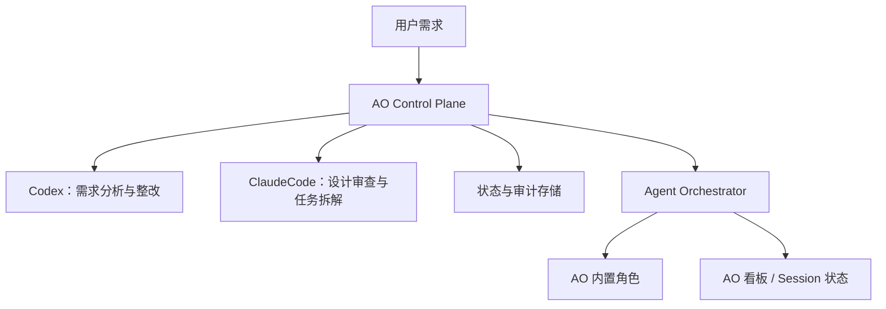

# 架构设计

## 总体架构

## 职责划分

### AO Control Plane

- 管理需求生命周期。
- 管理设计审查循环。
- 管理最大审查轮次。
- 管理结构化任务计划。
- 校验执行任务只能使用 AO 内置角色。
- 调用 `ao spawn --role` 下发任务。
- 轮询 `ao session ls --json --include-terminated` 采集状态。

### Agent Orchestrator

- 执行上层下发的任务。
- 根据 AO 内置角色选择实际 agent。
- 提供看板、session、PR、CI 和 review 状态。

## 执行层约束

任务进入 AO 执行层后，计划中只允许出现：

- `aoRole`
- `prompt`
- `dependencies`
- `dependencyCondition`
- `manualGate`

不允许出现：

- `agent`
- `model`
- `provider`
- `codex`
- `claudeCode`

这些字段会由计划校验器拒绝。
