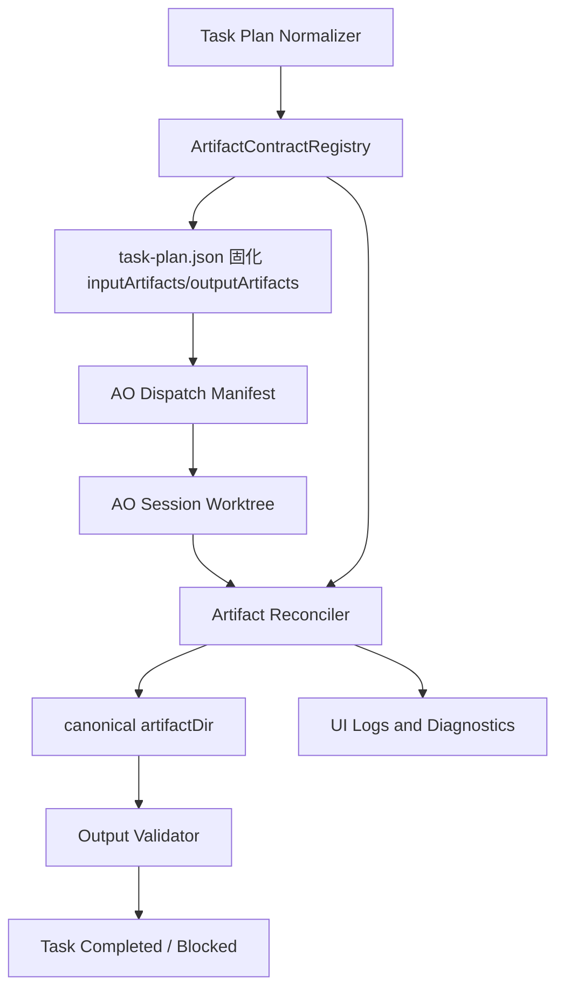
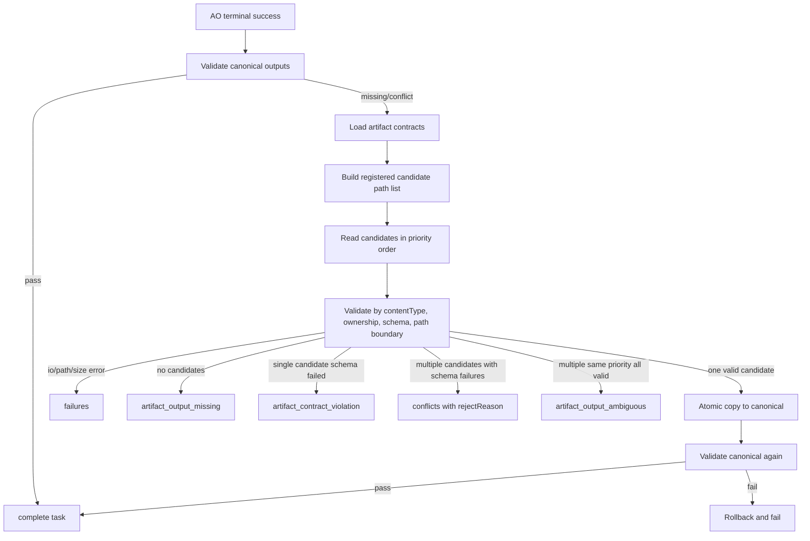

# 连续任务调度器控制面产物契约注册表设计方案

## 1. 背景

`WF-20260630T031508Z` 连续执行过程中已经连续出现两类相同本质的问题：

1. `TASK-006 / ft-7`：AO 已报告 `completed`，并在自己的 worktree 下写入了 `ipc_contract_review_gate_decision.json` 与 `ipc_contract_approved.flag`，但 canonical 控制面目录 `C:\workspace\fast-transport\.ao-control-plane\WF-20260630T031508Z` 缺少对应产物，调度器报 `artifact_output_missing`。
2. `TASK-008 / ft-9`：AO 已在 `docs/transport/transport-contract-freeze.{json,md}` 写入工程镜像文件，但 canonical 控制面目录缺少 `transport_contract_freeze.json`，调度器再次报 `artifact_output_missing`。

现有修复已经覆盖两种局部场景：

- AO 写到了 `worktree\.ao-control-plane\WF-...\` 时，可以归集回 canonical `artifactDir`。
- AO 写到了 worktree 内工程镜像目录，并且文件名只是 `_` 与 `-` 变体时，可以保守搜索、校验后归集。

但这仍然是“遇到一种错位路径，补一种归集规则”。根因并不只是路径不同，而是控制面产物缺少统一契约：

- 哪些任务必须产出哪些控制面文件，没有全部固化在任务计划中。
- canonical 路径、工程镜像路径、文件别名、JSON schema、归属字段、可归集规则分散在正则推断和 prompt 文案里。
- AO prompt 只强调 `expectedOutputs.path`，没有给出“工程镜像可以写，但必须同步 canonical”的机器可执行规则。
- 归集层只知道“目标文件名”，不知道“合法候选路径集合”和“候选优先级”。
- 页面只显示 `missing`，没有把“发现了候选但不敢归集”的原因展示出来。

本方案目标是一次性把“控制面产物是什么、应该写哪里、可以从哪里补救、如何验证、何时放行”收敛成统一的产物契约注册表，避免后续类似路径问题反复出现。

## 2. 与既有方案的关系

本方案不是推翻 `docs/task-plan-model-output-normalization-plan.md`，而是在其基础上把“任务产物规范化”升级为一等能力：

- `task-plan-model-output-normalization-plan.md` 解决模型输出任务计划结构不稳定的问题。
- 本方案解决任务计划可执行之后，控制面产物如何声明、写入、归集、校验、诊断的问题。
- 本方案会反向增强 task plan normalizer：最终 active task plan 中必须显式固化 `inputArtifacts` 与 `outputArtifacts`，运行期不能再仅靠正则猜测产物。

章节对照表：

| 原审查引用 | 本方案章节 | 说明 |
|---|---|---|
| 6.2 | 7.2 | 核心类型定义 |
| 7.2 | 8.2 | `inputArtifacts` 合并行为 |
| 7.3 | 8.3 | 任务计划产物契约门禁 |
| 8.1 | 9.1 | Dispatch Manifest |
| 9.4 | 10.4 | Worktree 解析边界 |
| 10.2 | 11.2 | Markdown 归属头 |
| 11.2 | 12.2 | 产物诊断 API |
| 12.2 | 13.2 | 已完成任务缺产物处置 |
| 15.1 | 16.1 | 注册表单元测试 |
| 16.6 | 17.6 | 页面候选与拒绝原因验收 |
| 17 | 18 | 落地清单 |

## 3. 目标

1. 建立控制面产物契约注册表，统一定义所有调度器关心的产物。
2. 任务计划规范化阶段必须把任务的 `inputArtifacts` 与 `outputArtifacts` 固化到计划中，避免运行期仅靠正则推断。
3. AO dispatch manifest 必须携带完整产物契约，包括 canonical 路径、允许镜像路径、允许别名、JSON 元数据要求和完成前自检要求。
4. AO 完成后，调度器按契约归集，不再仅按单一路径或临时文件名猜测。
5. 对候选产物执行强校验：归属字段、schema、大小、路径边界、来源证明、人工门禁模式。
6. 多候选、冲突、缺字段、schema 不通过时，页面和日志必须展示可操作原因。
7. 对当前 `WF-20260630T031508Z` 中已暴露和可预见的产物缺口进行幂等迁移和审计。
8. 保持源码改动与控制面产物分离：调度器只归集控制面产物，不复制 AO worktree 中的源码改动。

## 4. 非目标

1. 不改变 AO 每个 session 一个独立 worktree 的执行模型。
2. 不自动合并 AO PR 或源码改动。
3. 不因为找到了文件名相似的候选产物就放行；所有归集仍必须通过契约校验。
4. 不放宽人工门禁产物保护；`manual_approve` 模式下仍禁止 AO worktree 覆盖人工放行产物。
5. 不允许任务计划重新引入 `agent`、`model`、`provider`、`codex`、`claudeCode` 等具体执行器字段。

## 5. 核心判断

这不是单纯的 `artifact_output_missing` bug，而是产物契约建模缺失。

调度器现在同时依赖三套不完全一致的信息：

- `task-artifact-templates.ts` 中的正则模板。
- `task-plan-normalizer.ts` 中的运行前推断。
- `ao-dispatch-context.ts` 中的运行时推断与 prompt。

这三处如果任意一处漏掉任务、匹配错任务、文件名不一致，AO 就可能完成任务但控制面拿不到产物，或者控制面错误认为任务完成。

因此需要把产物定义提升为一等数据结构，由注册表统一驱动：

- 计划规范化。
- dispatch manifest。
- 运行前输入检查。
- AO 输出归集。
- 输出校验。
- 页面展示。
- 测试覆盖。

## 6. 总体方案

新增 `ArtifactContractRegistry`，每个控制面产物契约只定义一次。



执行原则：

1. canonical `artifactDir` 永远是控制面事实来源。
2. AO 可以额外写工程镜像文件，但完成前必须同步 canonical。
3. 调度器可以从当前 AO session worktree 中归集候选，但只能归集注册表声明的控制面产物。
4. 如果候选无法证明属于当前 `workflowId / taskId / aoSessionId`，必须阻断。
5. 如果候选多于一个且无法按优先级唯一确定，必须阻断并展示候选列表。

## 7. 产物契约注册表

### 7.1 新增文件与拆分方式

新增入口：

```text
src/workflow/artifact-contract-registry.ts
```

为避免注册表成为难以审查的巨型文件，按 domain 拆分：

```text
src/workflow/contracts/governance.ts
src/workflow/contracts/ipc.ts
src/workflow/contracts/transport.ts
src/workflow/contracts/outbound.ts
src/workflow/contracts/shared.ts
src/workflow/contracts/platform.ts
src/workflow/contracts/jar.ts
src/workflow/contracts/private-platform.ts
src/workflow/contracts/release.ts
src/workflow/contracts/index.ts
```

`artifact-contract-registry.ts` 只负责汇总、查询、校验和对外提供兼容接口。

注册表启动时一次性构建 `candidatePaths` 文件名索引，内存常驻，用于 `findContractByFileName(filename)` 查询。当前规模低于 1000 个契约，冷启动开销可以忽略；若后续契约规模超过 1000 个，再考虑 lazy build。注册表变更测试必须验证索引重建后查询结果与契约列表一致。

### 7.2 核心类型

```ts
export interface ArtifactContract {
  id: string;
  kind: string;
  canonicalFile: string;
  required: boolean;
  requiredWhen?: string;
  contentType: "json" | "flag" | "markdown" | "text";
  producer: {
    taskMatcher: RegExp;
    taskType?: Array<"design" | "implementation" | "test" | "refactor" | "review" | "docs" | "verification">;
    dependencyCondition?: "all_completed" | "manual_gate" | "any_completed";
    expectedPlanVersion?: "task-plan-current" | `task-plan-v${number}`;
  };
  candidatePaths: ArtifactCandidatePath[];
  jsonSchema?: ArtifactJsonSchemaContract;
  ownership: ArtifactOwnershipContract;
  markdownOwnership?: ArtifactMarkdownOwnershipContract;
  flagOwnership?: ArtifactFlagOwnershipContract;
  pathCaseSensitivity?: "case_insensitive" | "case_sensitive";
}

export interface ArtifactCandidatePath {
  file: string;
  priority: number;
  source: "canonical" | "worktree_control_plane" | "worktree_mirror" | "legacy_alias";
  relativeTo: "artifactDir" | "worktree" | "projectRoot";
  purpose: "primary" | "mirror" | "legacy_alias";
}

export interface ArtifactOwnershipContract {
  requiredFields: Array<"workflowId" | "taskId">;
  sessionField?: "aoSessionId" | "producedBySessionId" | "reviewerSessionId";
  allowMissingSessionForNonGateJson?: boolean;
}

export interface ArtifactMarkdownOwnershipContract {
  required: boolean;
  markerPattern: string;
  searchWindowLines: number;
}

export interface ArtifactFlagOwnershipContract {
  required: boolean;
  fields: Array<"workflowId" | "taskId" | "aoSessionId">;
  format: "kv" | "json";
}

export type ArtifactCompletionCheck =
  | "exists"
  | "valid-json"
  | "ownership-fields"
  | "markdown-header"
  | "flag-kv"
  | "case-insensitive-match";
```

字段约束：

1. `producer.taskType` 必须与 `taskTypeSchema.options` 对齐，不允许出现 `release` 这类 schema 不支持的枚举值。planning / design freeze 任务是否要求 required JSON，统一通过 `producer.taskMatcher` 判定，不能只依赖 `taskType`。
2. `producer.dependencyCondition` 由 `task-plan-gates.ts` 消费，用于第 8.3 节“同一 canonical 文件不能被多非互斥任务 required”的互斥判定。全部为 `manual_gate` 时允许复用，manual gate 与非 manual gate 混合复用时阻断。
3. `relativeTo="projectRoot"` 仅适用于主项目内受控控制面产物镜像，例如 `docs/`、`config/`、`schemas/`。它不得指向 `~/.agent-orchestrator/`，不得指向 AO worktree 源码目录，也不得用于复制源码改动。
4. `source` 与 `purpose` 必须满足固定映射：`canonical -> primary`、`worktree_control_plane -> primary`、`worktree_mirror -> mirror`、`legacy_alias -> legacy_alias`。落地时通过工厂函数或注册表自检强制校验。
5. `compat_variant` 是运行期描述性概念，不进入 `ArtifactCandidatePath.source` 枚举。`_` / `-` 派生候选的 `source` 沿用基础候选的 `source`，并通过日志字段 `derivedFrom` 标记来源，例如 `worktree_mirror/_dash_variant`。

### 7.3 `task-artifact-templates.ts` 兼容策略

不直接删除 `task-artifact-templates.ts`。落地方式为：

1. 注册表成为唯一事实来源。
2. `task-artifact-templates.ts` 保留对外导出的 `manualGateTemplates` 与 `taskOutputTemplates`，但内容由注册表派生，或内部查询注册表。
3. `task-plan-normalizer.ts` 与 `ao-dispatch-context.ts` 都改用注册表查询；保留模板导出只用于兼容未迁移调用点。
4. 增加测试保证 normalizer 与 dispatch manifest 看到的是同一批契约。
5. `task-artifact-templates.ts` 文件保留 3 个版本，文件内旧模板定义标注 deprecated；3 个版本后删除旧定义，只保留注册表派生兼容接口。

这样避免出现 normalize 阶段仍走旧正则、dispatch 阶段走注册表的双事实来源问题。

### 7.4 首批注册表内容

必须覆盖当前任务计划中所有已知控制面产物：

| 任务范围 | 产物 |
|---|---|
| G0 | `g0_repo_reality_check.json`、`g0_review_gate_decision.json`、`g0_approved.flag`、`g0_replan_request.json` |
| 治理冻结 | `gate_governance_freeze.json`、`gate_governance_freeze.md`、`gate_decision_schema.json`、`qa_verdict.json` |
| IPC 字节布局 | `ipc_byte_layout_freeze.json`、`ipc_byte_layout_freeze.md`、`ipc_byte_layout_qa_verdict.json` |
| IPC 容量边界 | `ipc_capacity_boundary_freeze.json`、`ipc_capacity_boundary_freeze.md` |
| IPC 门禁 | `ipc_contract_review_gate_decision.json`、`ipc_contract_approved.flag`、`ipc_contract_rework_request.json` |
| 共享传输抽象 | `transport_contract_freeze.json`、`transport_contract_freeze.md` |
| 共享传输门禁 | `transport_contract_review_gate_decision.json`、`transport_contract_approved.flag`、`transport_contract_rework_request.json` |
| Outbound 发送契约 | `outbound_contract_freeze.json`、`outbound_contract_freeze.md` |
| Outbound 门禁 | `outbound_contract_review_gate_decision.json`、`outbound_contract_approved.flag`、`outbound_contract_rework_request.json` |
| 共享边界 | `shared_boundary_manifest.json`、`shared_boundary_review_gate_decision.json`、`shared_boundary_approved.flag` |
| 平台适配 | `platform_adapter_contract.json`、`platform_adapter_review_gate_decision.json`、`platform_adapter_approved.flag` |
| JAR API | `jar_api_contract_freeze.json`、`jar_api_contract_review_gate_decision.json`、`jar_api_contract_approved.flag` |
| Linux 私有契约 | `linux_backend_contract_review_gate_decision.json`、`linux_backend_contract_approved.flag` |
| Windows IOCP 私有契约 | `windows_iocp_contract_review_gate_decision.json`、`windows_iocp_contract_approved.flag` |
| macOS kqueue 私有契约 | `macos_kqueue_contract_review_gate_decision.json`、`macos_kqueue_contract_approved.flag` |
| IPC 主路径门禁 | `ipc_main_path_review_gate_decision.json`、`ipc_main_path_review_approved.flag` |
| QA 汇总 | `unified_qa_verdict.json`、`qa_verdict_rework_request.json` |
| 发布 | `release_binary_archive.json`、`release_docs_evidence_archive.json`、`rollback_plan.json`、`release_review_gate_decision.json`、`release_approved.flag`、`release_rework_request.json` |

### 7.5 候选路径规则

每个产物声明允许的候选路径，而不是归集器自己猜。

以 `transport_contract_freeze` 为例：

```ts
{
  id: "transport_contract_freeze",
  kind: "transport_contract_freeze",
  canonicalFile: "transport_contract_freeze.json",
  contentType: "json",
  required: true,
  producer: {
    taskMatcher: /共享传输抽象与平台边界/
  },
  candidatePaths: [
    {
      source: "canonical",
      relativeTo: "artifactDir",
      file: "transport_contract_freeze.json",
      priority: 100,
      purpose: "primary"
    },
    {
      source: "worktree_control_plane",
      relativeTo: "worktree",
      file: ".ao-control-plane/{workflowId}/transport_contract_freeze.json",
      priority: 90,
      purpose: "primary"
    },
    {
      source: "worktree_mirror",
      relativeTo: "worktree",
      file: "docs/transport/transport-contract-freeze.json",
      priority: 80,
      purpose: "mirror"
    },
    {
      source: "legacy_alias",
      relativeTo: "worktree",
      file: "docs/transport/transport_contract_freeze.json",
      priority: 70,
      purpose: "legacy_alias"
    }
  ],
  ownership: {
    requiredFields: ["workflowId", "taskId"],
    sessionField: "producedBySessionId",
    allowMissingSessionForNonGateJson: true
  }
}
```

不再单独保留 `mirrorPaths` 字段，避免与 `candidatePaths` 重复。prompt 中展示的允许镜像路径从 `candidatePaths` 里筛选 `purpose === "mirror"` 得到。

`projectRoot` 候选路径白名单：

1. 允许前缀：`docs/`、`config/`、`schemas/`、`.ao-control-plane/`。
2. 禁止前缀：`src/`、`tests/`、`build/`、`dist/`、`target/`、`node_modules/`、`.git/`。
3. `projectRoot` 候选只用于发现工程镜像形式的控制面产物，不能作为源码合并、源码复制或测试产物复制通道。
4. `.ao-control-plane/` 仅指主项目根目录下的 `.ao-control-plane/`，等价于 `artifactDir` 入口；不表示 AO worktree 下的同名目录。`relativeTo="projectRoot"` 且指向 `.ao-control-plane/` 的候选视为等价 `relativeTo="artifactDir"`，但不能同时声明，见 §16.1.20 自检与 §19.5 风险说明。
5. 注册表自检必须验证所有 `relativeTo="projectRoot"` 的候选路径均落在允许前缀内。

### 7.6 文件名别名策略

允许别名必须注册，不能无限扩展模糊搜索。

默认只允许：

- canonical 文件名。
- 注册表声明的 `purpose=mirror` 文件。
- 注册表声明的 `purpose=legacy_alias` 文件。
- `_` 与 `-` 自动互转不进入注册表 `candidatePaths`，只在运行期作为派生候选存在，且只能基于已经注册的候选路径派生。

不自动接受：

- `.final.json`
- `.v1.json`
- `freeze.json`
- `decision.json`
- 未注册目录下的深层同名文件

当前 `buildCandidateFileNames()` 只能生成 `_` 与 `-` 整体替换，不会生成 `.final.json` 或 `.v1.json`。落地后保持这一边界，同时进一步收紧：`discoverCandidatePath` 不再扫描整个 worktree 任意目录同 basename 文件，只能检查注册表 `candidatePaths` 中 `relativeTo=worktree` 的目录前缀，以及由注册表候选路径派生出的 `_` / `-` 兼容变体路径。未在注册表声明的 alias 不允许出现在归集结果中。派生候选的 `source` 沿用基础候选的 `source`，并在日志和 UI 中通过 `derivedFrom` 标记其为派生变体。

扫描深度固定为“精确路径 + 一级目录变体”：

1. 精确路径：检查注册表声明的候选文件路径。
2. 一级目录变体：只在该候选文件所在目录下检查 `_` / `-` 文件名变体。
3. 不递归扫描子目录。例如注册表声明 `docs/transport/transport-contract-freeze.json` 时，不检查 `docs/transport/sub/transport-contract-freeze.json`。

## 8. 任务计划规范化

### 8.1 固化输出产物

修改：

```text
src/workflow/task-plan-normalizer.ts
```

规则：

1. 每个任务 normalize 时调用注册表。
2. 如果任务匹配一个或多个产物契约，必须把 `outputArtifacts` 写入最终 `task-plan.json`。
3. 如果任务已经显式写了 `outputArtifacts`，必须与注册表做一致性校验。
4. 如果显式产物与注册表冲突，产生 normalization issue，不能静默保留。

目标效果：

```json
{
  "taskId": "TASK-008",
  "outputArtifacts": [
    {
      "kind": "transport_contract_freeze",
      "path": "transport_contract_freeze.json",
      "required": true,
      "contractId": "transport_contract_freeze"
    },
    {
      "kind": "transport_contract_freeze_markdown",
      "path": "transport_contract_freeze.md",
      "required": false,
      "contractId": "transport_contract_freeze_markdown"
    }
  ]
}
```

schema 同步要求：

1. `src/schemas/task-plan.ts` 的 `taskArtifactSchema` 增加 `contractId: z.string().optional()`。
2. `ExecutionTask` / `TaskArtifact` 类型必须暴露 `contractId?: string`，不能只依赖 `.passthrough()` 的非类型化字段。
3. `ao-dispatch-context.ts`、`task-plan-gates.ts`、`ao-output-reconcile.ts` 读取任务产物时统一优先读 `contractId`，再按 `kind + path` 兼容旧计划。

### 8.2 固化输入产物

修改：

```text
src/workflow/ao-dispatch-context.ts
```

现状：只要任务显式存在 `inputArtifacts`，就不再自动推断依赖产物。

整改规则：

1. 显式 `inputArtifacts` 不再覆盖依赖产物。
2. 最终输入为 `explicit inputArtifacts + dependency outputArtifacts` 去重集合。
3. 去重按 `taskId + kind + path`。
4. 如果显式输入和依赖输出同 kind 但不同 path，标记 `artifact_input_conflict`，阻断派发。

这是明确的行为变更。必须同步更新：

- `src/workflow/ao-dispatch-context.test.ts`
- `src/workflow/task-plan-normalizer.test.ts`
- 任何依赖“显式 `inputArtifacts` 独占语义”的测试或调用点

### 8.3 计划审查增加产物契约门禁

修改：

```text
src/workflow/task-plan-gates.ts
```

新增 gate：

| 规则 | 实现位置 | 判定逻辑 |
|---|---|---|
| `manual_gate` 任务必须有 decision + flag | `task-plan-normalizer.ts`、`task-plan-gates.ts` | 注册表反向校验：每个 `manual_gate` 任务的 `outputArtifacts` 必须包含至少一个 decision JSON + approved flag 或 rework request |
| planning / design freeze 任务必须有 required JSON | `task-plan-normalizer.ts`、`task-plan-gates.ts` | 注册表 `required=true` 的契约若 `producer.taskMatcher` 匹配任务，必须在 `outputArtifacts` 中出现 |
| downstream 提到 `*_approved.flag` 必须有产出任务 | `task-plan-gates.ts` | 扫描所有下游 `acceptanceCriteria`、`aoPrompt` 与 `description`，提取明确 flag 名，使用 `findContractByFileName(filename)` 查 `candidatePaths` 文件名索引，确认注册表存在对应契约和产出任务 |
| outputArtifacts 反向校验 | `task-plan-gates.ts` | 每个 `outputArtifacts[].kind` 必须能在注册表找到契约；当前 active plan 已触发的契约，其 `producer.taskMatcher` 必须至少匹配到一个任务。未被当前 active plan 触发、仅属于未来 planVersion 的契约允许暂时无匹配任务 |
| 同一 canonical 文件不能被多非互斥任务 required | `task-plan-normalizer.ts`、`task-plan-gates.ts` | 扫描所有任务的 `outputArtifacts`，按 `path` 聚合，`required` 数量大于 1 时检查是否满足互斥规则 |

删除“任务文本模糊提取 xxx.json / xxx.flag 后阻断”的规则，避免 `xxx.flag` 占位符和示例文件名误报。若仍需要从文本提取候选文件名，只允许以下低风险模式并仅产生 warning：

- 反引号包裹的 `.json` / `.flag` 路径。
- 绝对路径。
- 显式“产出 xxx.json / 写入 xxx.flag”句式。

“非互斥”定义：

- 同一 `workflowId + kind + path` 被多个任务声明为 required output，且这些任务都可能在同一次正常执行路径上运行，则视为冲突。
- 若所有冲突任务均为 `dependencyCondition=manual_gate`，视为合法复用，不引入新的“互斥组”概念。
- `requiredWhen` 条件互斥的产物不视为冲突。
- manual gate 的 decision、approved flag、rework request 同属同一任务，不视为冲突。
- manual gate + 非 manual gate 混合复用同一 required canonical 文件，一律阻断。
- G0 模板中显式标注 `g0_review_gate_decision.json` 的复用规则：`manual_gate` 任务之间允许复用，implementation / design 任务不允许 reuse。

`requiredWhen` 表达式支持范围与当前 `evaluateRequiredWhen` 保持一致：

1. 只支持 `field=expected`。
2. 支持用 `&&` 连接多个条件。
3. 不支持 `||`、正则、通配符、括号表达式。
4. 注册表自检必须拒绝超出该范围的表达式，避免 evaluator 静默忽略。

注册表提供 `findContractByFileName(filename: string): ArtifactContract | undefined`，基于 `candidatePaths` 建索引，避免规则 3 反向遍历所有 `taskMatcher`。自检测试必须保证所有 `candidatePaths` 中的文件名唯一；确需同名时必须显式标注为 ambiguous 测试夹具，不能进入生产注册表。

若某个 manual gate 产出的 approved flag 没有被任何下游任务的 `acceptanceCriteria`、`aoPrompt` 或 `description` 明确引用，计划门禁记录 `gate_without_consumer` warning，不阻断计划。这样可以暴露门禁无消费者的风险，同时避免因任务文案没有显式写 flag 文件名而误杀已由依赖图约束的计划。

## 9. Dispatch Manifest 强化

### 9.1 Manifest 增加 `artifactContracts`

修改：

```text
src/workflow/ao-dispatch-context.ts
```

`DispatchContextManifest` 新增：

```ts
export type DispatchArtifactContract = Pick<
  ArtifactContract,
  | "kind"
  | "canonicalFile"
  | "required"
  | "requiredWhen"
  | "contentType"
  | "candidatePaths"
  | "ownership"
  | "markdownOwnership"
  | "flagOwnership"
  | "pathCaseSensitivity"
> & {
  contractId: ArtifactContract["id"];
  canonicalPath: string;
  producer: {
    taskMatcher: string;
    taskType?: string[];
    dependencyCondition?: string;
    expectedPlanVersion?: string;
  };
  requiredJsonFields: string[];
  completionChecks: ArtifactCompletionCheck[];
};

artifactContracts: DispatchArtifactContract[];
```

manifest 的 `artifactContracts` 与 `ArtifactContract` 共享 type alias，不再重复手写一套不完整字段。`allowedMirrorPaths` 与 `allowedCandidatePaths` 删除，统一使用 `candidatePaths: Array<{ file, priority, source, relativeTo, purpose }>`。prompt 渲染时如需展示镜像路径，从 `candidatePaths` 中筛选 `purpose === "mirror"` 或 `purpose === "legacy_alias"`。

`contractId` 是注册表 `id` 的对外别名，manifest 中只暴露 `contractId`，值必须等于 `ArtifactContract.id`。`canonicalPath = path.join(artifactDir, canonicalFile)`，AO 看到的是绝对路径，注册表保存的是相对文件名。

`producer.taskMatcher` 在 manifest 中序列化为 `/pattern/flags` 字符串，例如 `/共享传输抽象与平台边界/`、`/outbound.*contract/i`。派生函数固定为：

```ts
function serializeTaskMatcher(regex: RegExp): string {
  return `/${regex.source}/${regex.flags}`;
}
```

manifest 中的 `taskMatcher` 仅用于 prompt 展示与日志审计，不要求 AO 反向匹配或反序列化执行。

`requiredJsonFields` 由派生函数统一生成：

```ts
function getRequiredJsonFields(contract: ArtifactContract): string[] {
  return unique([
    ...contract.ownership.requiredFields,
    ...(contract.jsonSchema?.required ?? [])
  ]);
}
```

manifest 生成时必须调用 `getRequiredJsonFields(contract)`，不能在 `ao-dispatch-context.ts` 手写映射。

AO prompt 必须展示 `producer`、`ownership.requiredFields`、`ownership.sessionField`、`requiredJsonFields` 和 `completionChecks`，让 AO 知道契约来源、归属字段与完成前自检要求。

### 9.2 Prompt 文案改为硬规则

新增 prompt 段：

```text
control-plane output rules:
1. You MUST write every required output to canonicalPath.
2. You MAY also write engineering mirrors, but mirrors do not complete the task.
3. If you write a mirror first, copy it to canonicalPath before reporting completed.
4. Every JSON output MUST include workflowId, taskId, producedBySessionId.
5. Manual gate decision JSON MUST include source="ao_review" and aoSessionId.
6. Markdown outputs MUST include workflowId and taskId in the first 30 lines.
7. Flag outputs MUST include workflowId, taskId, and aoSessionId when produced by AO.
8. Before ao report completed, run an existence check for every required canonicalPath.
9. Before reporting completed, run these checks for each contract: ${completionChecks.join(", ")}.
```

### 9.3 给 AO 明确“镜像不是完成依据”

对 `TASK-008` 类任务，prompt 必须明确：

```text
docs/transport/transport-contract-freeze.json is an optional engineering mirror.
It is not the canonical control-plane output.
The canonical output is:
C:\workspace\fast-transport\.ao-control-plane\WF-...\transport_contract_freeze.json
```

## 10. 归集器改造

### 10.1 输入从 `ResolvedArtifact` 升级为 `ResolvedArtifactContract`

修改：

```text
src/workflow/ao-output-reconcile.ts
```

归集器不再只接收：

```ts
kind + targetPath
```

而是接收：

```ts
contractId + canonicalPath + candidatePaths + schema + ownership + content ownership rules
```

运行时类型：

```ts
export interface ResolvedArtifactContract {
  contractId: string;
  kind: string;
  canonicalPath: string;
  candidatePaths: ArtifactCandidatePath[];
  contentType: "json" | "flag" | "markdown" | "text";
  required: boolean;
  requiredWhen?: string;
  jsonSchema?: ArtifactJsonSchemaContract;
  ownership: ArtifactOwnershipContract;
  markdownOwnership?: ArtifactMarkdownOwnershipContract;
  flagOwnership?: ArtifactFlagOwnershipContract;
  pathCaseSensitivity?: "case_insensitive" | "case_sensitive";
}
```

`ArtifactContract` 是注册表定义，`ResolvedArtifactContract` 是归集器运行时输入，由注册表结合 `artifactDir`、`workflowId`、`taskId` 和候选路径模板解析得到。这里的 content ownership rules 指 `markdownOwnership + flagOwnership`，以及 text 类型可选的 marker 规则。

归集器必须按注册表 `contentType` 分流，不能按文件扩展名分流：

1. `contentType="json"`：校验 JSON schema、`ownership.requiredFields` 与 session 字段。
2. `contentType="markdown"`：校验 `markdownOwnership`。
3. `contentType="flag"`：校验 `flagOwnership`。
4. `contentType="text"`：未声明 marker 时仅做存在性校验；声明 `markdownOwnership` 或 marker 时按声明校验。
5. 候选文件扩展名与 `contentType` 明显不一致时，视为 `schema_failed` 的一种；单候选写入 `contractViolations`，多候选写入 `conflicts`，不归集该候选。

### 10.2 候选发现流程



结果字段优先级：

1. 若存在 `io_error`、`path_escape`、`size_exceeded`、`worktree_not_found`，写入 `failures`。
2. 若没有可读候选，写入 `missing`。
3. 若单候选存在但 schema、归属或 contentType 校验失败，写入 `contractViolations`。
4. 若多候选存在且任一候选出现 schema、归属或 contentType 校验失败，写入 `conflicts`；通过候选与失败候选都写入 `conflicts` 数组，UI 通过 `accepted=true/false` 区分，失败候选同时记录 `rejectReason`。
5. 若多候选同优先级且全部通过校验，写入 `ambiguousCandidates`。
6. 若唯一最高优先级候选通过校验，写入 `recovered`。

`ambiguousCandidates`、`conflicts`、`contractViolations` 三个字段对同一个 `contractId` 互斥，最多只填一个，避免 UI 和恢复逻辑出现双重解释。

### 10.3 候选优先级

优先级从高到低：

1. canonical 文件已经存在且通过校验。
2. worktree `.ao-control-plane\{workflowId}\canonicalFile`。
3. 注册表声明的 mirror 路径。
4. 注册表声明的 legacy alias。
5. 基于注册候选路径派生的 `_` 与 `-` 兼容变体。

如果最高优先级有多个候选，必须进入 `artifact_output_ambiguous`。

### 10.4 Worktree 解析边界

当前实现存在 `~/.agent-orchestrator/projects/*/worktrees/{aoSessionId}` 兜底扫描。落地后收紧为：

1. 归集器接口新增 `worktreePath?` 显式入参；如果提供该入参并且路径存在，直接使用该路径并跳过兜底扫描。
2. 其次使用 AO `listSessions()` 返回的 `worktreePath`。
3. 再其次使用当前 `projectRoot` 的 `git worktree list --porcelain` 匹配。
4. 只有在 `projectRoot` 能解析出 AO project id，且候选路径位于同一个 AO project 目录时，才允许 `~/.agent-orchestrator/projects/{projectId}/worktrees/{aoSessionId}` 兜底。
5. 禁止扫描所有 `~/.agent-orchestrator/projects/*`。
6. 如果使用了兜底路径，必须写入运行时日志 `worktree_path_discovered_via_fallback`，记录 `workflowId`、`taskId`、`aoSessionId`、`projectRoot`、`worktreePath` 和匹配来源，便于审计。

如果不能证明 worktree 属于当前 projectRoot，返回 `worktree_not_found`，不归集。

实现形态：

```ts
interface ResolvedAoWorktreePath {
  path?: string;
  discoveredVia: "explicit" | "session" | "git-worktree" | "fallback" | "not-found";
}
```

`resolveAoWorktreePath` 只返回解析结果，不直接写 execution log。`reconcileTaskOutputsFromAoWorktree` 把解析结果放入返回值的 `worktreeResolution` 字段；`continuous-plan-execution.ts` 与 `web/execution-jobs.ts` 根据 `discoveredVia === "fallback"` 追加 `worktree_path_discovered_via_fallback` 日志，避免底层工具函数依赖运行时日志通道。

### 10.5 类型与日志扩展清单

修改：

```text
src/workflow/execution-state-store.ts
src/workflow/continuous-plan-execution.ts
src/web/execution-jobs.ts
src/web/ui.ts
```

新增 `ExecutionErrorKind`：

```ts
| "artifact_output_ambiguous"
| "artifact_contract_missing"
| "artifact_contract_violation"
| "artifact_input_conflict"
```

其中 `artifact_input_conflict` 用于 8.2 节显式输入与依赖输出同 kind 不同 path 的阻断场景。

新增 `executionLogTypeSchema` 事件：

```ts
| "artifact_contract_resolved"
| "artifact_candidate_found"
| "artifact_candidate_rejected"
| "artifact_output_ambiguous"
| "artifact_contract_violation"
| "artifact_canonical_verified"
| "artifact_contract_missing"
| "artifact_input_conflict"
| "worktree_path_discovered_via_fallback"
| "migrate_plan_status_confirmed"
```

影响清单：

1. `ExecutionErrorKind` 增加以上分支。
2. `executionLogTypeSchema` 增加以上 10 个日志类型。
3. `ContinuousExecutionRunner` 的 output failure 分支映射以上类型。
4. `ArtifactReconcileResult` 增加 `ambiguousCandidates`、`contractViolations` 字段。
5. `web/execution-jobs.ts` 的 `failureKind` 联合类型扩展。
6. UI 的按钮状态和错误文案识别以上类型。
7. `continuous-plan-execution.ts` 当前 `artifact_output_missing` / `artifact_output_conflict` / `artifact_output_reconcile_failed` 映射分支必须扩展到 `artifact_output_ambiguous`、`artifact_contract_missing`、`artifact_contract_violation`、`artifact_input_conflict`。
8. `continuous-plan-execution.test.ts` 中既有 `artifact_output_recovered_from_worktree` / `artifact_output_normalized` 测试保留；新增事件只能补充，不能删除旧事件断言。
9. 旧日志 replay 保持兼容：未知新增字段忽略，已存在日志类型不重命名。

`ArtifactReconcileResult` 新增字段不合并进 `failures`：

```ts
interface ArtifactConflict {
  contractId: string;
  candidatePath: string;
  candidateSource: string;
  priority: number;
  accepted: boolean;
  rejectReason?:
    | "canonical_exists_with_different_content"
    | "workflow_mismatch"
    | "task_mismatch"
    | "source_proof_missing"
    | "unsupported_decision"
    | "schema_failed"
    | "ownership_missing"
    | "content_type_mismatch";
  expected?: string;
  actual?: string;
  derivedFrom?: string;
}

interface ArtifactReconcileResult {
  recovered: RecoveredArtifact[];
  skipped: SkippedArtifact[];
  conflicts: ArtifactConflict[];
  missing: MissingArtifact[];
  failures: ArtifactReconcileFailure[];
  ambiguousCandidates: Array<{
    contractId: string;
    candidates: Array<{
      path: string;
      source: string;
      priority: number;
      rejectReason?: string;
      derivedFrom?: string;
    }>;
  }>;
  contractViolations: Array<{
    contractId: string;
    reason: string;
    detail: string;
  }>;
  worktreeResolution?: ResolvedAoWorktreePath;
}
```

`ArtifactConflict` 是 v6 之后唯一冲突类型。落地时现有 `ConflictArtifactCandidate` 必须整体替换为 `ArtifactConflict`，归集器返回的 `conflicts` 字段类型从 `ConflictArtifactCandidate[]` 改为 `ArtifactConflict[]`。调用方同步迁移字段引用：`kind/path/reason` 不再作为冲突主字段使用，改读 `contractId/candidatePath/rejectReason`；`continuous-plan-execution.ts` 的日志映射也按新字段写入。`accepted=true` 表示该候选通过校验，`accepted=false` 表示该候选失败；`rejectReason` 仅在 `accepted=false` 时填写。

`failures` 继续表示 `io_error`、`path_escape`、`size_exceeded`、`worktree_not_found` 等底层错误；`ambiguousCandidates`、`conflicts` 与 `contractViolations` 是契约语义结果，对同一 `contractId` 互斥，调用方日志映射必须单独扩展，不得混在 `artifact_output_reconcile_failed` 里。

日志 payload schema：

```ts
type ArtifactContractResolvedPayload = {
  taskId: string;
  contractId: string;
  kind: string;
  canonicalPath: string;
  taskMatcher?: string;
};

type ArtifactCandidateFoundPayload = {
  taskId: string;
  contractId: string;
  kind: string;
  canonicalPath: string;
  candidatePath: string;
  candidateSource: string;
  priority: number;
  derivedFrom?: string;
};

type ArtifactCandidateRejectedPayload = ArtifactCandidateFoundPayload & {
  rejectReason: string;
};

type ArtifactOutputAmbiguousPayload = {
  taskId: string;
  contractId: string;
  candidates: Array<{ path: string; source: string; priority: number; derivedFrom?: string }>;
};

type ArtifactContractViolationPayload = {
  taskId: string;
  contractId: string;
  reason: string;
  detail: string;
};

type ArtifactCanonicalVerifiedPayload = {
  taskId: string;
  contractId: string;
  canonicalPath: string;
};

type ArtifactContractMissingPayload = {
  taskId: string;
  contractId: string;
  kind: string;
  canonicalPath: string;
};

type ArtifactInputConflictPayload = {
  taskId: string;
  kind: string;
  explicitPath: string;
  dependencyPath: string;
};

type WorktreePathDiscoveredViaFallbackPayload = {
  workflowId: string;
  taskId: string;
  aoSessionId: string;
  projectRoot: string;
  worktreePath: string;
  discoveredVia: "fallback";
};

type MigratePlanStatusConfirmedPayload = {
  operator: string;
  confirmedAt: string;
  workflowId: string;
  tasks: string[];
  statusBefore: Record<string, string>;
  statusAfter: Record<string, string>;
  confirmationMethod: "interactive" | "yes-flag";
};
```

## 11. 产物校验

### 11.1 JSON 统一归属字段

所有控制面 JSON 产物必须包含：

```json
{
  "workflowId": "WF-20260630T031508Z",
  "taskId": "TASK-008"
}
```

AO 产出的 JSON 推荐包含：

```json
{
  "producedBySessionId": "ft-9"
}
```

AO review manual gate 必须包含：

```json
{
  "source": "ao_review",
  "aoSessionId": "ft-9"
}
```

### 11.2 Markdown 归属头

Markdown 产物必须在前 30 行内包含：

```markdown
- **workflowId**: `WF-20260630T031508Z`
- **taskId**: `TASK-008`
```

如果没有归属头：

- required markdown：阻断。
- optional markdown：不归集，并记录 skipped reason。

### 11.3 Flag 文件归属字段

AO worktree 候选 flag 必须包含：

```text
approved
workflowId=WF-20260630T031508Z
taskId=TASK-009
aoSessionId=ft-10
```

兼容策略收紧为：

- canonical 已存在的历史 flag 可以通过现有校验兼容读取。
- 从 AO worktree 归集的 flag 必须包含 `workflowId/taskId/aoSessionId`，缺任一字段都阻断。
- 不再允许“同目录 decision 通过即可归集缺字段 flag”，避免掩盖归属不明问题。

### 11.4 `_` 与 `-` 兼容变体的归属校验

所有兼容变体候选都必须通过内容归属校验。兼容变体在运行时展示为 derived variant，不作为独立 source 枚举值：

- JSON：校验 `workflowId + taskId`。
- Markdown：校验前 30 行归属头。
- Flag：校验 KV 字段。
- Text：默认不允许兼容变体，除非注册表显式声明 schema 或 marker。

### 11.5 Text 类型契约

`contentType="text"` 默认不强制归属头，是否阻断由契约 `required` 决定：

1. required text 缺失时阻断。
2. optional text 缺失时跳过，并记录 skipped reason。
3. 如果 text 需要归属校验，必须在注册表中显式声明 `markdownOwnership`，复用 Markdown 前置窗口校验，或声明专用 `markerPattern`。
4. text 类型默认不允许 `_` / `-` 兼容变体；只有显式声明 schema 或 marker 后才允许派生候选。

## 12. 页面与日志

### 12.1 页面展示

在连续执行面板增加“产物诊断”区域。采用折叠式展示，默认只展开当前失败任务的诊断，避免日志噪声过大。

展示内容：

- 当前任务。
- required canonical outputs。
- 缺失文件。
- 发现的候选文件。
- 候选来源：canonical、worktree control-plane、mirror、legacy alias、derived variant。derived variant 不是独立 source，页面展示为“派生自 worktree_mirror/legacy_alias”等基础来源。
- 归集结果：recovered、skipped、conflict、ambiguous、schema failed。
- 下一步建议：重试归集、重跑任务、派发复核、人工阻断。

UI 整合说明：

1. 复用现有 `artifact_output_reconcile_started`、`artifact_output_recovered_from_worktree`、`artifact_output_normalized` 等事件，不重命名旧事件。
2. 新增后端 `artifact-diagnostics` API 返回最近一次 `ArtifactReconcileResult` 和注册表候选诊断。
3. 前端连续执行面板中新增折叠区展示候选列表、拒绝原因和候选来源。
4. 保留现有 manual gate、重试、重规划、标记阻断等操作按钮的布局位置不变。
5. UI 改动的视觉细节不作为本方案阻塞项；落地实现需保持信息可读、默认折叠、失败时可展开。

### 12.2 API

新增：

```text
GET /api/ao/execution-jobs/:jobId/artifact-diagnostics
```

返回当前失败任务或指定任务的诊断：

```ts
{
  taskId: string;
  contracts: Array<{
    contractId: string;
    canonicalPath: string;
    status: "verified" | "missing" | "recovered" | "ambiguous" | "violation";
    candidates: Array<{
      path: string;
      source: string;
      priority: number;
      accepted: boolean;
      rejectReason?: string;
      derivedFrom?: string;
    }>;
  }>;
}
```

### 12.3 日志事件

新增事件与第 10.5 节 `executionLogTypeSchema` 保持一致，落地时两处定义必须来自同一个 zod 枚举，避免重复维护。

```ts
artifact_contract_resolved
artifact_candidate_found
artifact_candidate_rejected
artifact_output_ambiguous
artifact_contract_violation
artifact_canonical_verified
artifact_contract_missing
artifact_input_conflict
worktree_path_discovered_via_fallback
migrate_plan_status_confirmed
```

产物候选相关日志必须记录：

- `contractId`
- `kind`
- `canonicalPath`
- `candidatePath`
- `candidateSource`
- `priority`
- `rejectReason`

状态迁移确认日志必须记录：

- `operator`
- `confirmedAt`
- `workflowId`
- `tasks`
- `statusBefore`
- `statusAfter`
- `confirmationMethod`

旧日志事件 `artifact_output_recovered_from_worktree`、`artifact_output_normalized` 保留，不重命名。

## 13. 当前工作流迁移

对 `WF-20260630T031508Z` 执行迁移必须幂等，且默认 dry-run。

### 13.1 迁移步骤

1. 重新读取 `task-plan.json`。
2. 用注册表补齐所有任务的 `outputArtifacts` 与必要的 `inputArtifacts`。
3. dry-run 生成 `artifact-contract-migration-report-{n}.json`，列出计划改动、产物缺口、状态建议。
4. 用户确认后，才写入 `task-plan-v{n}.json` 或当前系统认可的 active plan revision。
5. 对已完成任务执行只读 audit：
   - `TASK-007` 检查是否缺少 `ipc_capacity_boundary_freeze.json`。
   - `TASK-008` 检查 `transport_contract_freeze.{json,md}` 是否已归集。
   - 后续未执行任务只更新契约，不改状态。

### 13.2 已完成任务缺产物的处置

已完成任务缺 required canonical 产物时，不自动把状态改为 `failed`。

处理规则：

1. 如果 canonical 已存在且通过校验：状态保持 `completed`。
2. 如果 canonical 缺失但 AO worktree 有合法候选：先归集，再保持或恢复 `completed`。
3. 如果 canonical 缺失且没有合法候选：迁移报告标记 `requires_human_decision`，由页面提供“重跑任务”“人工确认豁免”“标记阻断”。
4. 状态回退必须是独立用户动作，不能由迁移 dry-run 自动执行。
5. 已完成任务需要回退时只允许进入 `blocked_for_human`，不直接置为 `failed`，避免依赖链立即卡死且丢失恢复入口。
6. 状态回退提供独立子命令 `migrate-plan-status --workflow WF-XXX --tasks TASK-007`，执行前需要二次确认。

二次确认机制：

1. CLI 默认交互式提示 `Y/N`，展示 workflow、影响任务、状态变更前后值和产物缺口摘要。
2. 自动化场景可用 `--yes` 跳过提示符，但必须同时提供 `--tasks`，禁止对整个 workflow 无选择批量回退。
3. 确认后写入 execution log 事件 `migrate_plan_status_confirmed`，记录操作者、时间、影响任务列表和确认方式。
4. dry-run 永远不写状态，也不写确认日志。

`migrate_plan_status_confirmed` payload 复用第 10.5 节 `MigratePlanStatusConfirmedPayload`，本节不重复定义字段，避免两处结构漂移。

### 13.3 `TASK-007` 专项处置

`TASK-007` 不能直接判定为“假完成”。必须先 audit：

1. canonical 是否存在 `ipc_capacity_boundary_freeze.json`。
2. TASK-007 对应的 AO session worktree 是否存在可归集候选；若历史状态中显示为 `ft-8`，仅作为示例参考。
3. 候选 JSON 是否包含 `workflowId=WF-20260630T031508Z` 与 `taskId=TASK-007`。

只有三项都不满足时，迁移报告才标记 `TASK-007` 为 `requires_human_decision`。

session ID 以 active state 为准，文档示例不作为运行时假设。落地时迁移脚本必须从 `execution-state.json` 的 `taskStates["TASK-007"].aoSessionId` 读取真实 session ID，不能硬编码 `ft-*`。

若 `TASK-007` 缺少 canonical 产物且没有合法候选，迁移报告同时生成 `TASK-007-recovery-candidate.json`，列出两种恢复路径：

1. “重新检查产物”：触发 reconcile，按契约归集 worktree 中已写的文件。
2. “重跑任务”：dispatch 新的 AO session 重写 `ipc_capacity_boundary_freeze.{json,md}`。

## 14. 当前已知高风险任务

必须重点覆盖：

| 任务 | 当前 plan 中的 taskId 验证 | 风险 | 处理 |
|---|---|---|---|
| `TASK-007` | 已在 `WF-20260630T031508Z/task-plan.json` 确认存在 | 当前模板未定义 `ipc_capacity_boundary_freeze.json`，可能无产物完成 | 增加契约并 audit 当前 canonical 与 AO worktree |
| `TASK-008` | 已在 `WF-20260630T031508Z/task-plan.json` 确认存在 | AO 写到 `docs/transport/transport-contract-freeze.*` | 注册 mirror path |
| `TASK-013` | 已在 `WF-20260630T031508Z/task-plan.json` 确认存在 | 可能写到 `docs/transport/outbound-contract-freeze.*` | 注册 mirror path |
| `TASK-016` | 已在 `WF-20260630T031508Z/task-plan.json` 确认存在 | `shared_boundary_manifest.json` 可能写入 docs 或测试目录 | 注册候选路径和 schema |
| `TASK-017` | 已在 `WF-20260630T031508Z/task-plan.json` 确认存在 | `platform_adapter_contract.json` 可能写入 docs/platform | 注册候选路径和 schema |
| `TASK-019` | 已在 `WF-20260630T031508Z/task-plan.json` 确认存在 | `jar_api_contract_freeze.json` 可能写入 docs/java 或 docs/jar | 注册候选路径和 schema |
| `TASK-062` | 已在 `WF-20260630T031508Z/task-plan.json` 确认存在 | Linux 私有契约门禁当前模板缺失 | 增加 manual gate contract |
| `TASK-070` | 已在 `WF-20260630T031508Z/task-plan.json` 确认存在 | Windows IOCP 私有契约门禁当前模板缺失 | 增加 manual gate contract |
| `TASK-076` | 已在 `WF-20260630T031508Z/task-plan.json` 确认存在 | macOS kqueue 私有契约门禁当前模板缺失 | 增加 manual gate contract |

## 15. 路径大小写策略

注册表 schema 增加：

```ts
pathCaseSensitivity?: "case_insensitive" | "case_sensitive";
```

`pathCaseSensitivity` 缺省时，归集器按运行时平台决定，而不是按注册表声明值决定：

- Windows 与默认 macOS 文件系统：case-insensitive。
- Linux：case-sensitive。

注册表显式声明 `pathCaseSensitivity` 时，才覆盖运行时平台策略；例如跨平台兼容性测试可以显式声明 `case_insensitive`，用于在 Linux CI 中验证 Windows 风格大小写候选。

canonical 写回时必须使用注册表声明的小写 canonical 文件名。

规则：

1. `Docs/Transport/Transport-Contract-Freeze.json` 可作为 Windows 候选匹配 `docs/transport/transport-contract-freeze.json`。
2. 写回 canonical 时仍写 `transport_contract_freeze.json`。
3. Linux 下候选路径默认 case-sensitive。
4. 注册表自检测试必须保证所有 `canonicalFile` 路径为小写。
5. 若契约声明 `pathCaseSensitivity: "case_sensitive"`，其 `candidatePaths` 不能包含大小写不一致的同名候选，避免在 case-sensitive 平台引入冲突。

## 16. 测试方案

### 16.1 注册表单元测试

新增：

```text
src/workflow/artifact-contract-registry.test.ts
```

注册表自检入口接收 `activePlanVersion` 与 active plan 快照，只校验当前版本已触发的契约；`producer.expectedPlanVersion` 指向未来版本的契约不会因当前 plan 暂未匹配而失败。

覆盖：

1. 每个注册表契约都有唯一 `id/kind/canonicalFile`。
2. 当前 active plan 已触发的契约，其 `producer.taskMatcher` 至少匹配一个当前 active plan 任务；未触发契约按 `producer.expectedPlanVersion` 跳过当前 plan 匹配。
3. 每个契约的 `candidatePaths` 中至少包含一个 `source=canonical`。
4. 每个契约的 candidatePaths 之间 priority 不冲突，除非显式用于 ambiguous 测试。
5. 每个 required JSON 契约都要求 `workflowId/taskId`。
6. 每个 markdown 契约都声明 `markdownOwnership` 或明确 `required=false`。
7. 每个 flag 契约都声明 `flagOwnership`。
8. manual gate 契约都有 decision、approved flag、rework request。
9. 当前 active plan 中所有 `outputArtifacts[].kind` 都能在注册表中找到契约。
10. 同一 path 在 required 列表中不能被多任务引用，除非全部为 `dependencyCondition=manual_gate`。
11. 所有 `canonicalFile` 路径必须小写。
12. 注册表可派生 `manualGateTemplates` 与 `taskOutputTemplates`。
13. 注册表变更后 task-plan gate 能重新运行并发现缺口。
14. 所有 `producer.taskType` 必须是 `taskTypeSchema.options` 子集。
15. 每个 candidatePath 的 `source` 与 `purpose` 必须符合固定映射。
16. 所有 `relativeTo="projectRoot"` 候选路径前缀必须在受控白名单内。
17. 所有生产注册表 `candidatePaths` 文件名不重复。
18. 所有 `requiredWhen` 表达式必须落在 evaluator 支持范围内。
19. 第 14 节列出的高风险 taskId 必须能在 `WF-20260630T031508Z` active plan 中验证存在。
20. `relativeTo="projectRoot"` 且指向 `.ao-control-plane/` 的候选，与 `relativeTo="artifactDir"` 候选只能二选一，不能同时声明。
21. `findContractByFileName` 索引在注册表重建后查询结果保持一致。
22. 所有 `producer.taskMatcher.flags` 不包含 `g`，避免状态化正则；允许 `i`、`m`、`s`、`u`。
23. 当前 active plan 中所有 manual_gate 任务产生的 approved flag，若没有在任一下游任务的 `acceptanceCriteria`、`aoPrompt` 或 `description` 中被引用，产生 `gate_without_consumer` warning。
24. 声明 `pathCaseSensitivity: "case_sensitive"` 的契约，其 `candidatePaths` 不能包含大小写不一致的同名候选。

### 16.2 归集测试

扩展：

```text
src/workflow/ao-output-reconcile.test.ts
```

覆盖：

1. canonical 缺失，worktree control-plane 存在，自动归集。
2. canonical 缺失，registered mirror 存在，自动归集。
3. mirror 存在但 JSON 缺 `workflowId/taskId`，阻断。
4. 两个同优先级候选同时存在，返回 `artifact_output_ambiguous`。
5. 非 JSON markdown 缺归属头，required 时阻断。
6. worktree flag 缺归属字段，阻断。
7. 未注册 alias 不归集。
8. `_` 与 `-` 兼容变体只在注册路径派生范围内生效；派生候选的 source 与基础候选一致，UI 展示时附带 `derivedFrom` 标记。
9. 跨项目同名 session worktree 不归集。
10. Windows 大小写候选路径可匹配但 canonical 写回小写文件名；该测试只在 Windows 或 macOS 跑，Linux 跑同测试时必须显式声明 `pathCaseSensitivity: "case_insensitive"`。
11. 显式 `worktreePath` 入参存在时，直接使用该路径并跳过兜底扫描。
12. 未传入 `worktreePath` 且 `session.worktreePath` 存在时，使用 session 路径。
13. 未传入 `worktreePath`、session 不存在且 `git worktree list` 命中时，使用 git worktree 路径。
14. fallback 解析路径时，返回 `worktreeResolution.discoveredVia="fallback"`，调用方写入 `worktree_path_discovered_via_fallback` 日志。
15. fallback 解析失败或无法证明同属当前 projectRoot 时，返回 `worktree_not_found`。
16. text 类型契约、candidatePath 以 `.txt` 结尾且未声明 marker 时，仅做存在性校验并允许归集。
17. 单候选 `contentType="json"` 但 candidatePath 扩展名为 `.md` 时，写入 `contractViolations`。
18. 多候选中部分 contentType 不一致且部分通过校验时，写入 `conflicts`；通过候选带 `accepted=true`，失败候选带 `accepted=false` 和 `rejectReason`。
19. 冲突时 `rejectReason` 必须是 `ArtifactConflict.rejectReason` 枚举之一。
20. 现有归集测试中所有 `ConflictArtifactCandidate` 断言改为 `ArtifactConflict` 断言，覆盖 `contractId/candidatePath/candidateSource/priority/accepted/rejectReason` 字段引用。

### 16.3 计划规范化测试

扩展：

```text
src/workflow/task-plan-normalizer.test.ts
```

覆盖：

1. `TASK-007` 自动固化 `ipc_capacity_boundary_freeze.json`。
2. `TASK-008` 自动固化 `transport_contract_freeze.json/md`。
3. `TASK-062/070/076` 自动固化私有契约门禁产物。
4. 显式 `outputArtifacts` 与注册表冲突时产生 normalization issue。
5. 显式 `inputArtifacts` 与依赖输出合并，不再独占覆盖。

### 16.4 Web/API 测试

扩展：

```text
src/web/server.test.ts
src/web/execution-jobs.test.ts
```

覆盖：

1. 页面展示候选列表和 reject reason。
2. `reconcile-artifacts` 返回 `ambiguous/conflict/missing/recovered` 结构。
3. `GET /api/ao/execution-jobs/:jobId/artifact-diagnostics` 返回当前任务契约诊断。
4. 对 failed 状态任务执行归集后恢复 running。
5. 对 working 状态任务仍禁止手动归集完成。

### 16.5 真实场景回归

对 `WF-20260630T031508Z` 回归：

1. `TASK-006 / ft-7` worktree control-plane 归集。
2. `TASK-008 / ft-9` docs mirror 归集。
3. 人工模拟 `TASK-013` 写入 `docs/transport/outbound-contract-freeze.json`，验证能归集。
4. 人工模拟两个候选文件，验证页面显示 ambiguous。
5. 审计 `TASK-007`，验证缺口不会静默假完成。

## 17. 验收标准

1. 当前 `WF-20260630T031508Z` 不再因 `transport_contract_freeze.json` 路径错位卡住。
2. `TASK-007` 的产物缺口被 audit 出来，不能再无产物假完成。
3. 所有任务的控制面产物都在最终 active task plan 中显式体现。
4. AO prompt 中明确 canonical 和 mirror 的关系。
5. 归集器不再扫描整个 worktree 任意同名文件，只按注册表候选路径和兼容变体归集。
6. 多候选、schema 失败、归属失败时页面能显示具体候选和拒绝原因。
7. `pnpm typecheck`、`pnpm lint`、`pnpm test` 全部通过。
8. 新增测试覆盖 `TASK-006`、`TASK-008`、`TASK-013`、`TASK-062`、`TASK-070`、`TASK-076` 类路径和门禁场景。

## 18. 落地清单

本次一次性完成，不拆后续阶段：

1. 新增 `artifact-contract-registry.ts`、`contracts/*` 与测试。（对应验收 2、3、5、7、8）
2. 改造 `task-artifact-templates.ts`，由注册表派生 `manualGateTemplates` 与 `taskOutputTemplates`，不保留双事实来源。（对应验收 3、7）
3. 改造 `task-plan-normalizer.ts`，固化所有 `inputArtifacts/outputArtifacts`。（对应验收 2、3、7）
4. 改造 `task-plan-gates.ts`，增加产物契约审查门禁。（对应验收 2、3、7）
5. 改造 `ao-dispatch-context.ts`，manifest 增加 `artifactContracts`。（对应验收 4、7）
6. 改造 `ao-output-reconcile.ts`，按契约候选路径、优先级、schema、markdown 归属头和 flag 字段归集，详见调用点同步清单。（对应验收 1、5、6、7、8）
7. 改造 `continuous-plan-execution.ts`，接入新失败类型和日志事件，详见调用点同步清单。（对应验收 1、6、7）
8. 改造 `execution-state-store.ts`，增加失败类型和日志类型。（对应验收 6、7）
9. 改造 `web/execution-jobs.ts` 与 `server.ts`，提供 `artifact-diagnostics` API。（对应验收 6、7）
10. 改造 Web UI，增加折叠式产物诊断区域。（对应验收 6）
11. 增加幂等迁移工具或内部函数，对当前 active plan 补齐产物契约并生成 dry-run 迁移报告。（对应验收 1、2、3）
12. 在 `src/cli.ts` 注册 `migrate-plan-status` 命令，复用迁移脚本的 dry-run / apply / 二次确认逻辑。（对应验收 2、7）
13. 补齐单元测试、API 测试和真实场景回归记录。（对应验收 7、8）

调用点同步清单是落地清单第 6 条与第 7 条的细化，不是额外阶段：

1. `continuous-plan-execution.ts:644`：从 `taskState.worktreePath` 或 session snapshot 读取 `worktreePath` 后传入 `reconcileTaskOutputsFromAoWorktree`。
2. `continuous-plan-execution.ts:1021`：手动归集入口同样传入 `worktreePath`，并处理 `worktreeResolution` 日志。
3. `web/execution-jobs.ts`：`reconcile-artifacts` 与后续 `artifact-diagnostics` API 必须透传 job 当前 taskState 的 worktree 信息。
4. `ao-output-reconcile.test.ts`：所有 helper 默认支持显式 `worktreePath`，并覆盖未传入时的 session / git worktree / fallback 解析。

## 19. 风险与边界

1. 不能把搜索范围扩大到整个磁盘，只能在当前 AO session worktree 内查找。
2. 不能扫描所有 `~/.agent-orchestrator/projects/*`；只允许当前 projectRoot 可证明关联的 AO project。
3. 不能复制源码文件到主项目，只能复制注册表声明的控制面产物。
4. `relativeTo="projectRoot"` 候选只能指向受控控制面目录，例如 `docs/`、`schemas/`、`config/`、`.ao-control-plane/`，不允许指向 `src/`、`tests/`、`build/`、`dist/`、`target/`、`node_modules/`、`.git/`。
5. `relativeTo="projectRoot"` 候选容易被误解为源码复制通道，尤其是指向 `.ao-control-plane/` 时必须按 §7.5 的 canonical 等价规则处理，并通过自检验证白名单与二选一约束。
6. 不能因为文件名匹配就归集，必须验证归属字段。
7. 不能用 AO report 文案替代产物文件。
8. 不能让人工放行产物被 AO worktree 覆盖。
9. 对历史缺归属字段的产物只能通过受控迁移报告处理，不能永久放宽。
10. 注册表是新的系统级事实来源，必须通过自检测试和 task-plan gate 保证正确性。

## 20. 不采纳项说明

### 20.1 不物理删除 `task-artifact-templates.ts`

不采纳“完全删除 `task-artifact-templates.ts`”的做法。

边界说明：

1. 该文件当前是 `ao-dispatch-context.ts` 与 `task-plan-normalizer.ts` 共用入口，直接删除会扩大改动面并增加回归风险。
2. 本方案仍然整改“双事实来源”问题：文件保留，但内容改为由注册表派生，旧模板定义标注 deprecated。
3. 所有调用点必须切换到注册表派生结果；保留文件只作为兼容壳，计划 3 个版本后删除旧定义。

### 20.2 不把 UI wireframe 作为本方案阻塞项

不采纳“必须先产出独立 wireframe 文档后才能实现”的做法。

边界说明：

1. 本方案核心是后端产物契约、归集、校验、诊断接口，不以视觉稿作为落地前置条件。
2. UI 必须实现折叠式产物诊断区域，并保留现有 manual gate 操作布局位置不变。
3. 若实现阶段发现布局冲突，再补充 UI 草图；但不把 wireframe 作为本方案验收的阻塞项。

### 20.3 不引入新的“互斥组”概念

不采纳为“同一 canonical 文件被多个任务作为 required output”新增互斥组模型。

边界说明：

1. 现有任务计划已有 `dependencyCondition` 与 `manual_gate` 语义，足够表达本次需要的互斥判定。
2. 本方案只使用现有字段判断：全部为 `manual_gate` 可视为合法复用，manual gate + 非 manual gate 混合复用一律阻断。
3. 不新增互斥组可以避免任务计划 schema 膨胀，也避免与现有依赖图语义重叠。

### 20.4 不把 `artifact-diagnostics` API 改成无 `ao` 前缀

不采纳“统一为 `/api/execution-jobs/:jobId/artifact-diagnostics`”的路径建议。

边界说明：

1. 当前后端入口实际挂载在 `src/web/server.ts` 的 `/api/ao/execution-jobs/...` 前缀下，前端 `src/web/ui.ts`、服务端测试 `src/web/server.test.ts` 也统一使用该前缀。
2. 本方案新增 API 属于 AO 连续执行能力，应保持在同一个 `/api/ao/execution-jobs/:jobId/...` 命名空间下，避免与未来非 AO execution jobs 混淆。
3. 若后续要做 API 前缀治理，应作为独立兼容迁移处理，不能在本次产物契约注册表改造中引入破坏性路由变更。

本方案完整采纳原审查报告 17 项整改要求中的 14 项，落地细节已在第 7-15 章明确。仅 3 项因边界原因不予采纳：不删除 `task-artifact-templates.ts`（§20.1）、不要求 UI wireframe 阻塞实施（§20.2）、不引入互斥组（§20.3）。

本轮新增 22 项问题中，除 API 前缀改名建议因现有路由事实不采纳并已在 §20.4 说明外，其余建议均已纳入第 2、7-19 章。

第四轮审查报告新增 10 项问题均已采纳并纳入第 7-19 章；本轮没有新增不采纳项。

第五轮审查报告新增 5 项高优先级问题与 4 项边界建议均已采纳并纳入第 7-19 章；本轮没有新增不采纳项。

第六轮审查报告新增 3 项高优先级问题与 2 项低优先级建议均已采纳并纳入第 7-19 章；本轮没有新增不采纳项。

## 21. 最终效果

落地后，调度器面对 AO 输出会有明确判断：

- 写到了 canonical：直接校验并完成。
- 写到了注册 mirror：校验后自动归集。
- 写到了未注册路径：阻断并提示“路径未注册”。
- 写了多个候选：阻断并提示候选列表。
- 写了 JSON 但缺归属字段：阻断并提示缺字段。
- 写了 markdown 但缺归属头：按 required 规则阻断或跳过。
- 写了 flag 但缺 KV 归属字段：worktree 候选阻断。
- 写了源码或工程文档但没有控制面产物：不完成任务。

这样后续不需要继续按 `ft-*` 的个案补路径规则，而是通过统一产物契约让计划、prompt、归集、校验和页面诊断使用同一份事实来源。
