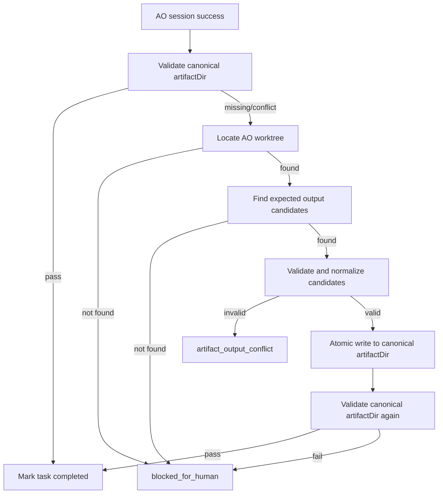

# 连续任务调度器产物归集与 AO Worktree 清理设计方案

## 1. 背景

当前连续任务调度器已经具备任务顺序执行、依赖判断、AO session 派发、AO 状态观测、门禁复核派发和控制面产物校验能力。真实执行 `WF-20260630T031508Z` 时，`TASK-006` 暴露出新的执行期缺口：

- 调度器给 `ft-7` 派发了明确的 `dispatchContextManifest`，其中 `artifactDir` 指向 `C:\workspace\fast-transport\.ao-control-plane\WF-20260630T031508Z`。
- `ft-7` 在 AO 看板中报告 `TASK-006` 审查通过，并声明已经写入 `ipc_contract_review_gate_decision.json` 与 `ipc_contract_approved.flag`。
- 控制面页面仍报 `artifact_output_missing`，因为主项目 `artifactDir` 下没有必需产物。
- 实际产物被写入了 `ft-7` 自己的 worktree：`C:\Users\niuniu\.agent-orchestrator\projects\fast-transport_53d581ab27\worktrees\ft-7\.ao-control-plane\WF-20260630T031508Z\...`。
- 产物内容还存在元数据不一致：AO 复核门禁产物应使用 `source: "ao_review"` 和 `aoSessionId: "ft-7"`，但实际写成了 `source: "control_plane_manual_gate"`。

这说明之前的上下文桥接适配层已经能“发现不一致并阻断”，但还缺少“在可证明安全时自动归集和归一化产物”的能力。同时，AO 每个 session 都有独立 worktree，长期运行后也需要清理策略，避免 worktree 和临时产物无限累积。

本方案承接 `docs/continuous-task-scheduler-context-bridge-design.md` 中关于 `artifactDir`、`expectedOutputs`、`source`、`aoSessionId`、`manualGateReleases[].mode` 和 `validateTaskOutputArtifacts` 的约定，不重新定义门禁字段语义，只补齐执行期归集、归一化、重检和 worktree 清理能力。

## 2. 目标

本次设计目标如下：

1. 强化 AO prompt，明确控制面产物必须写入 `expectedOutputs.path` 的绝对路径。
2. 增加产物归集层，当 AO 把产物写入 session worktree 时，调度器可安全识别、校验、归一化并复制回 canonical `artifactDir`。
3. 保留当前严格校验：归集后仍必须通过 `validateTaskOutputArtifacts`，不能仅凭 AO 报告文字放行。
4. 增加执行日志和页面提示，让用户能看清“AO 已完成、产物写错位置、已归集、或归集失败”的具体原因。
5. 设计 AO worktree 生命周期和清理策略，避免历史 session 长期占用磁盘。
6. 不绕过 GitHub PR、review、CI、merge 等 AO 原生源码交付流程。

## 3. 非目标

1. 不改变 AO 自身“每个 session 一个独立 git worktree”的基本模型。
2. 不要求 AO 自动把所有 worktree 内容合并到主干。
3. 不把 AO 看板报告文字视为最终完成依据。
4. 不自动合并源码改动、不自动删除仍有排查价值或未合并 PR 的 worktree。
5. 不在任务计划中重新允许 `agent`、`model`、`provider` 等具体执行器字段。执行器选择仍由 AO 配置决定。

## 4. AO Worktree 使用语义

### 4.1 Worktree 是什么

AO 每次 `ao spawn` 会为 session 创建独立 git worktree，例如：

```text
C:\Users\niuniu\.agent-orchestrator\projects\fast-transport_53d581ab27\worktrees\ft-7
```

每个 worktree 通常对应一个独立分支，例如：

```text
session/ft-7
```

它的作用是隔离并发任务，避免多个 AO worker 同时修改主工作区。

### 4.2 Worktree 中的代码什么时候进入主干

普通源码改动不应该由控制面直接复制进主项目目录。标准路径是：

1. AO 在自己的 worktree 修改代码。
2. AO 创建 PR。
3. CI、review、merge 条件通过。
4. PR 合并后，改动进入主干。
5. 主项目工作区通过正常 git 更新获得这些改动。

因此，`session/ft-*` 中的代码长期留在 worktree 里是 AO 的隔离模型，不是控制面缺陷。

### 4.3 控制面产物与源码改动不同

`.ao-control-plane\WF-...` 下的文件属于控制面执行证据和调度状态输入，例如：

- `*_gate_decision.json`
- `*_approved.flag`
- `qa_verdict.json`
- `release_decision.json`
- `execution-state.json`
- `execution-log.jsonl`
- `dispatch-context\*.json`

这类文件的 canonical 位置是主项目的 `artifactDir`：

```text
C:\workspace\fast-transport\.ao-control-plane\WF-20260630T031508Z
```

AO worktree 中的同名文件只视为临时副本。调度器最终只以 canonical `artifactDir` 为准。

## 5. 产物归集层设计

### 5.1 触发时机

产物归集在 AO session 进入成功终态后触发，先于 `artifact_output_missing` 或 `artifact_output_conflict` 最终失败：

```text
AO terminal success
  -> validateTaskOutputArtifacts
  -> missing/conflict?
  -> tryReconcileTaskOutputsFromAoWorktree
  -> validateTaskOutputArtifacts again
  -> pass: task completed
  -> fail: blocked_for_human
```

成功终态沿用现有集合，例如 `idle`、`completed`、`mergeable` 等当前已被调度器识别为 terminal success 的状态。

### 5.2 Worktree 定位

新增 `AoWorkspaceResolver`，负责根据当前 `aoSessionId` 找到 AO worktree。

候选来源按优先级：

1. `ao status --json --reports full` 中 session 对象如果暴露 worktree/workspace 路径，则直接使用。
2. `git -C projectRoot worktree list --porcelain` 中匹配 `branch refs/heads/session/{aoSessionId}`。
3. AO 项目目录约定路径：`~\.agent-orchestrator\projects\{projectId}\worktrees\{aoSessionId}`。

解析结果必须满足：

- 路径存在。
- 路径是 git worktree。
- 当前分支或元数据与 `aoSessionId` 匹配。
- 路径位于 AO 管理目录下，不能指向任意用户目录。

如果无法定位 worktree，只记录 `artifact_output_reconcile_skipped`，继续走现有缺失/冲突失败逻辑。

### 5.3 候选产物路径

对每个 expected output，计算 AO worktree 中的候选路径：

```text
relative = path.relative(canonical artifactDir, expectedOutput.path)
candidate = aoWorktree\.ao-control-plane\{workflowId}\relative
```

例如：

```text
canonical:
C:\workspace\fast-transport\.ao-control-plane\WF-20260630T031508Z\ipc_contract_review_gate_decision.json

candidate:
C:\Users\niuniu\.agent-orchestrator\projects\fast-transport_53d581ab27\worktrees\ft-7\.ao-control-plane\WF-20260630T031508Z\ipc_contract_review_gate_decision.json
```

只允许归集 `expectedOutputs` 中声明的文件，不扫描和复制任意文件。

路径计算必须同时支持相对和绝对 `expectedOutput.path`：

- 如果 `expectedOutput.path` 是相对路径，先按现有 `resolveArtifact` 规则解析到 canonical `artifactDir` 下。
- 如果 `expectedOutput.path` 是绝对路径，使用 `path.relative(artifactDir, expectedOutput.path)` 计算 `relative`。
- 如果 `relative` 为空、以 `..` 开头，或解析后目标不在 canonical `artifactDir` 内，拒绝归集并记录 `artifact_output_reconcile_failed:reason=path_escape`。
- 候选路径拼接后也必须再次校验位于当前 AO worktree 内。

### 5.4 安全校验

归集前必须逐项校验：

0. 如果当前 task 在 `manualGateReleases` 中已经存在 `mode="manual_approve"` 的 release，直接拒绝任何归集尝试，记录 `artifact_output_reconcile_skipped:reason=manual_approve_protected`。人工放行链路的产物只能由控制面生成或由用户显式重新决策，不能被 AO worktree 产物覆盖。
1. 候选文件存在。
2. 候选文件路径位于当前 session worktree 内。
3. canonical 目标路径位于当前 workflow 的 `artifactDir` 内。
4. 文件类型符合预期：
   - `.json` 必须是合法 JSON。
   - `.json` 必须是小型结构化产物，大小上限建议 1MB。
   - `.flag` 必须是小文本文件，大小上限建议 64KB。
5. JSON 产物必须匹配 `workflowId` 和 `taskId`。
6. 对门禁 decision/verdict 类文件，必须匹配当前执行上下文：
   - 当前 release mode 是 `ao_review` 时，允许从 AO worktree 归集。
   - 当前 release mode 是 `manual_approve` 时，不允许从 AO worktree 归集，也不允许覆盖人工放行产物。
7. 如果 canonical 目标已存在且内容不同：
   - 默认不覆盖。
   - 进入 `artifact_output_conflict`。
   - 页面提示用户选择“保留控制面产物”或“重新派发复核”。

### 5.5 归一化规则

对于 AO 复核门禁产物，归集时可进行受控归一化。

适用条件：

- 当前 task 是 `manual_gate` 或 `manualGateReleases[].mode = "ao_review"`。
- 候选文件来自当前 `aoSessionId` 的 worktree。
- JSON 中 `decision` 为允许值，例如 `approved`、`rework_required`、`rejected`。
- `workflowId`、`taskId` 匹配当前任务。

归一化内容：

```json
{
  "source": "ao_review",
  "aoSessionId": "ft-7"
}
```

来源证明规则必须显式白名单化：

- `source === "ao_review"` 且 `aoSessionId === currentSessionId`：已合规，直接归集。
- `source === "ao_review"` 但缺少 `aoSessionId`：仅当候选文件来自当前 session worktree，且 `workflowId`、`taskId` 匹配时，允许补齐 `aoSessionId`。
- `source === "control_plane_manual_gate"` 且 `decidedBy` 包含当前 `aoSessionId` 子串：允许归一化。
- `source === "control_plane_manual_gate"` 且 `reviewerSessionId === currentSessionId`：允许归一化。
- `source === "control_plane_manual_gate"` 且 `reviewerIndependence.reviewerSessionId === currentSessionId`：允许归一化。
- 其他情况一律视为 `artifact_output_conflict`，不归一化、不写回 canonical `artifactDir`。

如果原文件中存在 `source: "control_plane_manual_gate"`，但上述来源证明规则能证明它来自当前 AO session，则允许改写为 `ao_review`，并记录原始值：

```json
{
  "source": "ao_review",
  "aoSessionId": "ft-7",
  "normalizedFrom": {
    "source": "control_plane_manual_gate"
  }
}
```

如果无法证明来自当前 session，不归一化，进入 `artifact_output_conflict`。

### 5.6 写入方式

归集写入必须使用原子写：

1. 写入临时文件：`{target}.tmp-{pid}-{timestamp}`。
2. 校验临时文件可读。
3. rename 到 canonical target。
4. 失败时清理临时文件。

对于一组产物，例如 decision + flag，应尽量作为同一归集事务处理：

- 先校验全部候选。
- 再写入全部 canonical 文件。
- 任一失败则删除本轮已写入文件。
- 不删除本轮之前已经存在的用户文件。
- 如果写入成功但后续 canonical `validateTaskOutputArtifacts` 失败，调用方必须把本轮写入视为失败事务，按 `ReconcileFailure.rolledBackPaths` 回滚本轮写入文件；无法回滚时进入 `artifact_output_reconcile_failed` 并提示人工处理。
- `ArtifactReconcileResult.failures` 必须记录写盘失败、校验失败、回滚结果和仍遗留的文件路径，避免用户无法判断是否需要人工清理。

## 6. Prompt 加强

现有 prompt 已区分 `dependencyArtifacts` 和 `expectedOutputs`。本次继续增强 `expectedOutputs` 约束：

```text
You must write every required expected output to the exact absolute path listed below.
Do not write control-plane outputs only under your AO worktree.
Before reporting completed, verify each required output exists at its expectedOutputs.path.
If you accidentally wrote the file under your worktree .ao-control-plane, copy it to the exact expectedOutputs.path before reporting completed.
For AO review manual gates, gate decision JSON must contain source="ao_review" and aoSessionId="{currentSessionId}".
```

由于 `aoSessionId` 在 `ao spawn` 返回后才知道，prompt 中不能在首次派发前填入真实 sessionId。解决方式：

1. prompt 中提示 AO 在生成产物前回查自己的 session metadata、AO 看板信息或 AO CLI 提供的 session 标识；不要在 prompt 拼装阶段尝试填入未来的 `sessionId`。
2. 调度器归集层在回收时补齐 `aoSessionId`。
3. 如果 AO 产物已直接写到 canonical `artifactDir`，但缺少 `aoSessionId`，仍由 `validateTaskOutputArtifacts` 判冲突，除非后续增加受控修复。

## 7. 状态机与日志

### 7.0 `waiting_manual_gate` 保留语义

连续任务调度器主循环对常规 `manual_gate` 任务默认采用 AO reviewer 自动复核，不再把常规门禁任务自动停在 `waiting_manual_gate` 等待人工输入。

`waiting_manual_gate` 状态仍保留，语义限定为人工兜底和历史状态兼容：

1. 旧执行状态或外部 API 已经进入 `waiting_manual_gate` 时，Web 端仍能恢复并展示门禁上下文。
2. AO reviewer 不可用、证据缺失、反复阻断或用户明确需要人工处理时，仍可使用人工放行、派发门禁复核、要求重规划、标记阻断等入口。
3. 该状态不是常规连续执行的默认分支；常规分支仍由调度器按依赖关系派发 AO reviewer 并通过 canonical `artifactDir` 产物校验推进。

因此，`approveManualGate`、`dispatchManualGateReview` 和相关页面按钮不是主循环必经路径，而是恢复与人工兜底入口。后续如果确认不再需要历史兼容和人工兜底，应单独设计状态机收敛方案，再移除该状态和相关 API。

### 7.1 新增日志类型

新增执行日志：

```ts
artifact_output_reconcile_started
artifact_output_recovered_from_worktree
artifact_output_reconcile_skipped
artifact_output_reconcile_failed
artifact_output_normalized
worktree_cleanup_candidate_detected
worktree_cleanup_completed
worktree_cleanup_failed
```

### 7.2 Failure kind

现有 failure kind 保留：

- `artifact_output_missing`
- `artifact_output_conflict`

新增可选 failure kind：

- `artifact_output_reconcile_failed`：发现候选文件，但归集过程失败。
- `worktree_cleanup_failed`：清理 worktree 失败，不影响当前任务完成，但页面需要提示。

如果归集失败，本质上仍是产物不能被控制面信任，因此最终任务状态仍进入 `blocked_for_human`。

归集层采用 fail-fast 语义：一旦出现 `failures` 或不可归一化的 `conflicts`，当前 task 立即阻断，不继续派发后续 task。归集函数本身只返回结构化结果，不直接修改执行状态；状态迁移由 `continuous-plan-execution.ts` 统一决策，保持与 `validateTaskOutputArtifacts` 相同的调用风格。

### 7.3 状态流转



## 8. 页面设计

### 8.1 执行日志展示

在连续执行页面追加简单过程日志：

- 当前任务。
- 当前 AO session。
- AO 状态。
- 最近一次产物校验结果。
- 是否尝试从 worktree 归集。
- 归集了哪些文件。
- 归集后是否通过校验。

示例：

```text
TASK-006 / ft-7：AO 已报告 completed。
控制面缺少 ipc_contract_review_gate_decision.json。
已在 ft-7 worktree 中发现候选产物。
已归一化 source=ao_review、aoSessionId=ft-7。
已写回 canonical artifactDir。
产物校验通过，任务完成。
```

### 8.2 失败提示

如果归集失败，页面应显示：

- canonical 期望路径。
- AO worktree 候选路径。
- 失败原因。
- 可操作按钮：
  - “重试任务”
  - “重新检查产物”
  - “人工确认完成”
  - “提交重规划请求”

“人工确认完成”必须继续保留强提示：该动作会绕过自动产物校验，只适用于用户已经人工核实并接受风险的场景。

## 9. API 设计

### 9.1 重新检查产物

新增或扩展接口：

```http
POST /api/ao/execution-jobs/:jobId/reconcile-artifacts
```

行为：

1. 读取当前 failed/running 状态。
2. 找到当前 task 和 `aoSessionId`。
3. 执行一次归集尝试。
4. 重新运行输出产物校验。
5. 如果通过，推进任务状态。
6. 返回归集报告。

返回示例：

```json
{
  "ok": true,
  "taskId": "TASK-006",
  "aoSessionId": "ft-7",
  "recovered": [
    {
      "kind": "ipc_contract_review_gate_decision",
      "from": "C:\\Users\\niuniu\\.agent-orchestrator\\projects\\...\\worktrees\\ft-7\\.ao-control-plane\\WF-...\\ipc_contract_review_gate_decision.json",
      "to": "C:\\workspace\\fast-transport\\.ao-control-plane\\WF-...\\ipc_contract_review_gate_decision.json",
      "normalized": true
    }
  ],
  "completed": true
}
```

### 9.2 Worktree 清理预览

```http
GET /api/ao/execution-jobs/:jobId/worktree-cleanup-candidates
```

返回可清理 worktree 列表，不执行删除。

### 9.3 Worktree 清理执行

```http
POST /api/ao/execution-jobs/:jobId/worktree-cleanup
```

请求体：

```json
{
  "sessionIds": ["ft-5", "ft-6"],
  "dryRun": false
}
```

清理必须要求明确 sessionIds，不能默认全删。

说明：执行任务相关接口沿用当前项目已有 `/api/ao/execution-jobs/...` 前缀，不改为 `/api/execution-jobs/...`。worktree 清理接口挂在具体 `jobId` 下，避免额外传入 `projectRoot`，并复用 `ExecutionJobManager` 已持有的项目上下文。

## 10. Worktree 清理策略

### 10.1 可清理条件

满足以下条件之一可列为候选：

1. session 已被 `supersededSessions` 标记，且不是当前任务 session，且 `git -C {worktree} status --porcelain` 为空，且 session 对应 PR 不存在或已 closed/merged。
2. session 状态为 terminal failed/stuck，用户已经重试并产生新 session。
3. session 对应 PR 已 merged 或 closed，且无未提交变更。
4. session 已完成，控制面产物已归集到 canonical `artifactDir`，且 worktree 中无未提交源码改动。

`supersededSessions` 只表示调度器放弃继续追踪该 session，不等价于安全可清理。清理候选必须同时检查 git status、PR 状态、当前任务引用和 AO 管理目录归属。

### 10.2 禁止清理条件

以下情况禁止自动清理：

1. 当前执行任务的 `aoSessionId`。
2. 状态为 `working`、`spawning`、`needs_input`。
3. 有未合并 PR。
4. worktree 中存在未提交源码变更。
5. 分支不是 `session/*` 或不是 AO 管理目录。
6. 用户未显式选择清理。

### 10.3 清理方式

清理不能直接删除目录，必须优先走：

```text
git -C {projectRoot} worktree remove --force {worktreePath}
git -C {projectRoot} worktree prune
```

如果 `git worktree remove` 失败：

- 不直接 fallback 删除有 git 注册的 worktree。
- 记录 `worktree_cleanup_failed`。
- 页面显示失败原因和建议。

分支删除默认不做。是否删除 `session/ft-*` 分支应单独设计，避免误删仍需审计的历史。

## 11. 模块改造

### 11.1 `ao-dispatch-context.ts`

新增：

- 更强 prompt instructions。
- expected output 绝对路径写入确认要求。
- AO review decision 元数据要求说明。

### 11.2 `ao-output-reconcile.ts`

新增模块，负责：

- 根据 task、state、plan、artifactDir、aoSessionId 定位 expected outputs。
- 定位 AO worktree。
- 查找候选产物。
- 校验和归一化 JSON。
- 原子写入 canonical artifactDir。
- 返回结构化归集报告。

核心接口：

```ts
export interface ArtifactReconcileResult {
  recovered: RecoveredArtifact[];
  skipped: ReconcileSkip[];
  conflicts: ConflictArtifact[];
  missing: MissingArtifact[];
  failures: ReconcileFailure[];
}

export interface ReconcileFailure {
  kind: string;
  path: string;
  reason:
    | "atomic_write_failed"
    | "canonical_validation_failed"
    | "invalid_json"
    | "io_error"
    | "path_escape"
    | "rollback_failed"
    | "size_exceeded";
  detail?: string;
  rolledBackPaths?: string[];
  rollbackFailedPaths?: string[];
}

export async function reconcileTaskOutputsFromAoWorktree(input: {
  task: ExecutionTask;
  plan: TaskPlan;
  state: ExecutionState;
  artifactDir: string;
  projectRoot?: string;
  aoSessionId: string;
  manualGateMode?: "manual_approve" | "ao_review";
  sessions: unknown;
}): Promise<ArtifactReconcileResult>;
```

`reconcileTaskOutputsFromAoWorktree` 是“读取上下文、尝试归集、返回报告”的纯归集函数，不直接把任务标记为 completed 或 failed。调用方必须按以下规则处理：

- `recovered.length > 0 && failures.length === 0 && conflicts.length === 0`：重新运行 `validateTaskOutputArtifacts`。
- `failures.length > 0`：进入 `artifact_output_reconcile_failed`。
- `conflicts.length > 0`：进入 `artifact_output_conflict`。
- `missing.length > 0 && recovered.length === 0`：保持 `artifact_output_missing`。
- `skipped.reason === "manual_approve_protected"`：不再尝试归集，保持人工放行产物不变。

### 11.3 `continuous-plan-execution.ts`

调整 AO 成功终态处理：

1. 首次 `validateTaskOutputArtifacts`。
2. 如果通过，任务完成。
3. 如果缺失或冲突，调用 `reconcileTaskOutputsFromAoWorktree`。
4. 再次 `validateTaskOutputArtifacts`。
5. 仍失败、归集 failures 非空或 conflict 不可修复时进入 `blocked_for_human`。

### 11.4 `execution-jobs.ts`

新增 API 方法：

- `reconcileArtifacts(jobId)`
- `listWorktreeCleanupCandidates(jobId)`
- `cleanupWorktrees(jobId, sessionIds, dryRun)`

### 11.5 `ui.ts`

新增页面能力：

- “重新检查产物”按钮。
- 产物归集过程日志。
- worktree 清理候选展示。
- “清理已废弃 session worktree”动作。

## 12. 测试计划

### 12.1 单元测试

1. AO prompt 包含 expected output 绝对路径写入要求。
2. `artifactDir` 缺文件、AO worktree 有文件时，归集成功。
3. AO review decision 中 `source=control_plane_manual_gate` 但来自当前 session 时，归一化为 `ao_review`。
4. `workflowId` 不匹配时拒绝归集。
5. `taskId` 不匹配时拒绝归集。
6. canonical 文件已存在且内容不同，进入 conflict，不覆盖。
7. manual approve 模式下拒绝从 AO worktree 覆盖人工门禁产物。
8. `.flag` 文件超过大小限制时拒绝归集。
9. JSON 非法时拒绝归集。
10. 找不到 worktree 时保持现有 missing 失败。
11. worktree 存在但对应路径下没有 expected output 文件时，结果为 `missing`，不是 `conflict`。
12. 绝对路径 `expectedOutput.path` 使用 `path.relative(artifactDir, expectedOutput.path)` 计算候选路径。
13. `source` 归一化只接受明确来源证明：`decidedBy` 包含当前 session、`reviewerSessionId` 等于当前 session、或 `reviewerIndependence.reviewerSessionId` 等于当前 session。
14. 归集写入成功但二次 canonical 校验失败时，回滚本轮写入文件，并在 `failures` 中记录 `rolledBackPaths`。
15. `supersededSessions` 只有在 git status 为空且 PR 不存在或已 closed/merged 时才进入清理候选。

### 12.2 集成测试

1. `TASK-006` 类 AO review manual gate：AO 把产物写入 worktree，runner 自动归集并完成任务。
2. 归集后继续调度下一个依赖 `TASK-006` 的任务。
3. 归集失败时页面 API 返回清晰原因。
4. `reconcile-artifacts` API 对 failed 状态可重试。
5. worktree cleanup dry-run 只返回候选，不删除。
6. cleanup 拒绝删除当前 task session。
7. cleanup 拒绝删除 `supersededSessions` 中仍有未提交源码改动的 session。
8. UI mock 覆盖“重新检查产物”按钮、归集成功日志、归集失败原因展示。

### 12.3 回归测试

继续运行：

```text
pnpm typecheck
pnpm lint
pnpm test
```

## 13. 验收标准

1. AO 产物写在当前 session worktree 的 `.ao-control-plane\WF-...` 下时，调度器能在安全校验通过后自动归集到 canonical `artifactDir`。
2. AO review 门禁产物归集后包含 `source: "ao_review"` 和当前 `aoSessionId`。
3. 归集后仍必须通过 `validateTaskOutputArtifacts` 才能标记任务完成。
4. 页面能展示产物缺失、候选路径、归集结果、归一化结果。
5. 用户可以手动触发“重新检查产物”，用于处理已经 failed 的任务。
6. worktree 清理只列出安全候选，不会删除当前执行、仍在工作、仍有未合并 PR、有未提交源码改动，或仅被 `supersededSessions` 标记但尚未满足 git/PR 安全条件的 session。
7. 清理通过 `git worktree remove` 和 `git worktree prune` 执行，不直接破坏 git worktree 元数据。
8. 所有新增逻辑有针对性测试覆盖。

## 14. 当前 `TASK-006 / ft-7` 的恢复方式

本方案落地后，当前场景应按如下方式恢复：

1. 用户点击“重新检查产物”。
2. 调度器发现 canonical `artifactDir` 缺少 `ipc_contract_review_gate_decision.json`。
3. 调度器定位 `ft-7` worktree。
4. 调度器找到：

```text
C:\Users\niuniu\.agent-orchestrator\projects\fast-transport_53d581ab27\worktrees\ft-7\.ao-control-plane\WF-20260630T031508Z\ipc_contract_review_gate_decision.json
C:\Users\niuniu\.agent-orchestrator\projects\fast-transport_53d581ab27\worktrees\ft-7\.ao-control-plane\WF-20260630T031508Z\ipc_contract_approved.flag
```

5. 调度器校验 `workflowId=WF-20260630T031508Z`、`taskId=TASK-006`、`decision=approved`。
6. 调度器将 decision 归一化为 `source: "ao_review"`、`aoSessionId: "ft-7"`。
7. 调度器原子写回：

```text
C:\workspace\fast-transport\.ao-control-plane\WF-20260630T031508Z\ipc_contract_review_gate_decision.json
C:\workspace\fast-transport\.ao-control-plane\WF-20260630T031508Z\ipc_contract_approved.flag
```

8. 调度器重新校验产物，通过后标记 `TASK-006` 完成并继续后续任务。

## 15. 风险与边界

1. 不能把“AO 报告 completed”当成完成依据，仍以 canonical artifactDir 校验为准。
2. 不能自动复制任意 worktree 文件，只能复制 expected outputs 声明的文件。
3. 不能在 manual approve 模式下用 AO worktree 产物覆盖人工产物。
4. 不能自动合并源码 worktree，这是 PR/merge 流程职责。
5. worktree 清理必须默认保守，宁可多留历史，也不能误删仍需要复核的任务现场。
6. `supersededSessions` 不是可清理证明，只是调度器追踪状态；清理必须额外校验 git status、PR 状态和当前任务引用。
7. 归集层只修复控制面产物落点和可证明的元数据不一致，不修复 AO 产物的业务结论。如果 decision 内容本身不满足验收标准，应由 reviewer 或人工复核处理。

## 16. 审查整改记录

本轮根据 `continuous-task-scheduler-artifact-reconcile-and-worktree-cleanup-review.md` 完成以下整改：

1. 已整改 P0：`manual_approve` 模式增加硬阻断。只要当前 task 已存在 `manualGateReleases[].mode = "manual_approve"`，归集层必须跳过并记录 `manual_approve_protected`，不得覆盖人工放行产物。
2. 已整改 P1：worktree 清理候选不再把 `supersededSessions` 视为充分条件，必须同时满足 git status 为空、PR 不存在或已 closed/merged、不是当前 task session。
3. 已整改 P2：`ArtifactReconcileResult` 增加 `failures`，并定义 `ReconcileFailure` 的失败原因、回滚路径和回滚失败路径。
4. 已整改 P2：明确归集层 fail-fast 语义。归集函数只返回结果，状态迁移由调度器统一处理。
5. 已整改 P2：补充绝对路径 `expectedOutput.path` 的候选路径计算和 path escape 防护。
6. 已整改 P2：补充归集后二次校验失败的回滚语义。
7. 已整改 P2：细化 AO review 归一化来源证明规则。
8. 已整改 P3：worktree cleanup API 挂到 `jobId` 下，避免额外传 `projectRoot`。
9. 已整改 P3：修正 prompt 中 `aoSessionId` 获取时序说明。
10. 已整改 P3：补充 worktree 存在但缺 expected output、绝对路径 expected output、`supersededSessions` 与 git status 联动、UI mock 等测试项。
11. 已整改 P3：在背景中引用上下文桥接设计的字段约定，避免重复定义。

不采纳项：

1. 不采纳“将接口前缀改为 `/api/execution-jobs/...`、`/api/worktrees/...`”。原因是当前项目现有执行任务端点实际使用 `/api/ao/execution-jobs/...`，例如启动、查询、停止、重试、标记完成、门禁决策、派发复核和重规划都在该前缀下。为保持现有路由风格，本方案保留 `/api/ao/execution-jobs/...`，但采纳“统一挂在执行 job 语境下”的建议，将 worktree 清理接口调整为 `/api/ao/execution-jobs/:jobId/worktree-cleanup-candidates` 和 `/api/ao/execution-jobs/:jobId/worktree-cleanup`。
