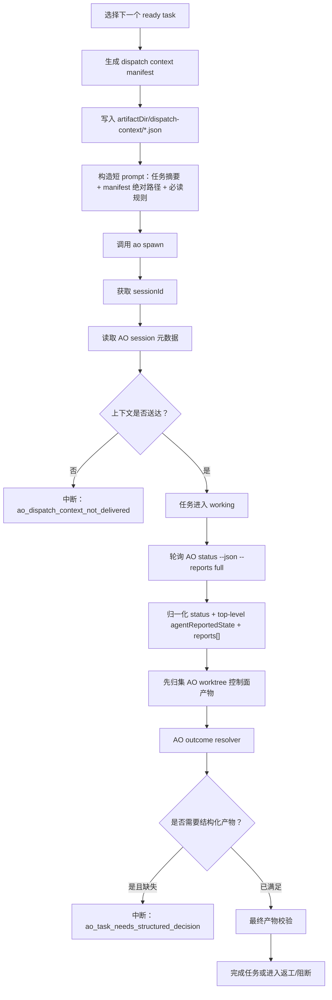

# 连续任务调度器派发上下文与 AO 报告完整性修复设计

## 1. 背景与结论

当前需求 `C:\workspace\fast-transport\.ao-control-plane\WF-20260630T031508Z` 在 `TASK-009 / ft-12` 上出现两个关键问题：

1. 调度器已经生成增强上下文 `dispatch-context/ao-dispatch-context-TASK-009-attempt-3.json`，其中明确包含 `artifactDir`、`mustReadBeforeAskUser`、`expectedOutputs`、`artifactContracts` 和禁止只看 AO worktree 的规则；但 AO session `ft-12.json` 中保存的 `userPrompt` 只有原始任务计划中的 `task.aoPrompt`，没有 `AO Control Plane Context`，也没有 `dispatchContextManifest`。
2. `ft-12` 已通过 AO report 上报 `waiting`，AO 侧 `.agent-report-audit/ft-12.ndjson` 显示 `accepted=true`；但调度器仍显示 workflow `running`，任务 `TASK-009` 仍是 `working`，因为调度器当前主要消费 AO session 的 `status=idle`，没有把 top-level `agentReportedState=waiting` 归一化为可处理的 AO outcome。

结论：这不是单点补丁问题，而是“派发上下文交付链路”和“AO 报告消费链路”的完整性缺陷。必须做系统性修复，避免后续所有 manual gate、reviewer 任务和结构化产物任务重复出现“AO 已上报，但调度器空转”或“增强路径约束生成了，但 AO 没收到”的问题。

## 2. 本次修复目标

本次修复必须一次性完成以下能力：

1. **派发上下文必须可验证送达**：调度器调用 `ao spawn` 后，必须确认 AO session 实际保存或可读取完整增强上下文。
2. **长 prompt 传递必须稳定**：不能再依赖单纯 `--prompt <long text>` 在 Windows shell、AO CLI、agent runtime 多层传递中不丢内容。
3. **AO report 必须进入 outcome resolver**：`agentReportedState=waiting`、`needs_input`、`completed`、`failed` 等 AO 已接受报告必须被调度器识别。
4. **manual gate reviewer 不允许无结构化产物空转**：reviewer 如果报告 `waiting`、`needs_input` 或结束，但没有写 `decision JSON`，调度器必须进入明确中断状态，展示缺少的结构化产物和下一步处理按钮。
5. **运行中防空转**：当 AO session 处于 `idle`，但存在更新的 accepted report 时，以 report 语义优先，不能继续显示健康 running。
6. **页面可解释**：页面必须展示当前 AO report、调度器判定、缺失结构化产物、增强上下文路径和建议动作。

## 3. 不采用的方案

### 3.1 只重试 ft-12

不采用。重试只能绕过当前 session，不能保证后续 `TASK-010`、`TASK-011` 或其他 manual gate 不再丢上下文。

### 3.2 只把 `waiting` 当失败

不采用。`waiting` 在普通 implementation 任务、manual gate reviewer、QA 任务中的含义不同。必须通过 AO outcome 语义层结合任务类型、`dependencyCondition`、期望产物和 report note 判断。

### 3.3 只加强 prompt 文案

不采用。当前问题已经证明文案生成成功但没有送达 AO session。必须增加送达校验与失败中断。

## 4. 总体架构

修复后，连续调度器的任务派发和状态回收链路如下：



## 5. 派发上下文交付修复

### 5.1 当前问题

`buildAoDispatchContext` 生成的完整 prompt 是正确的，构造结果包含：

- `AO Control Plane Context / AO 控制平面上下文`
- `workflowId`
- `taskId`
- `projectRoot`
- `artifactDir`
- `dispatchContextManifest`
- `MUST_READ_BEFORE_ASK_USER`
- `expectedOutputs`
- `artifactContracts`

但 `ft-12.json` 的 `userPrompt` 只有原始 `task.aoPrompt`。这里必须区分两个阶段：

1. 调度器本地已经生成完整增强 prompt 和 manifest。
2. AO session 元数据没有保存完整增强 prompt，也没有保存 `dispatchContextManifest` marker。

因此本次修复不能只改 prompt 文案，而要验证 AO CLI 接收、AO session 元数据保存、agent runtime 读取三段链路。实现前必须补充 Windows + AO CLI + agent runtime 多层传递实测，至少覆盖 `--prompt` 在 1KB、10KB、100KB、1MB 下的保存情况；如果短 prompt 中的 manifest 路径都无法完整保存在 session 元数据中，则必须切换到 `--prompt-file` 或 `--prompt-stdin`，不能继续依赖 `--prompt` 字符串。

### 5.2 修复策略

将 AO 派发 prompt 从“完整长文本全部塞进 `--prompt`”调整为“短 prompt + manifest 文件绝对路径 + 强制送达校验”。如果实测证明 `--prompt` 仍会截断短 prompt 的 manifest marker，则 `AoCliAdapter.spawnTask` 必须改用 `--prompt-file <path>` 或 `--prompt-stdin`，让 AO 从文件或标准输入读取派发指令。

短 prompt 不是只保留路径提示，而是必须保留“AO 能独立开工所需的最小任务指令”。当前实现的 `buildAoDispatchContext` 会把 `task.aoPrompt` 放在完整上下文 prompt 开头，因此改短链路时必须同时满足：

1. manifest 中新增 `originalAoPrompt` 字段保存完整 `task.aoPrompt`，作为任务正文事实源。
2. 短 prompt 包含任务摘要、manifest 绝对路径、`deliveryToken` 和“读取 manifest 中 `originalAoPrompt` 后再开工”的硬约束。

不允许短 prompt 只包含 manifest 路径、`workflowId` 和 `taskId` 却不说明 `originalAoPrompt` 的位置，否则会从“上下文没送达”退化为“任务正文没送达”。

短 prompt 必须包含以下内容：

```text
workflowId=...
taskId=...
任务名称=...
AO 角色=...

必须先读取调度器上下文文件：
C:\workspace\fast-transport\.ao-control-plane\WF...\dispatch-context\ao-dispatch-context-TASK-009-attempt-3.json

禁止只依据 AO worktree 判断上游产物缺失。
如果无法读取该 manifest，必须 ao report needs-input，并说明 manifest 路径读取失败。
```

完整 manifest 继续保存在 `artifactDir/dispatch-context` 下，作为机器可读事实源。

### 5.3 代码改造点

| 模块 | 改造内容 |
| --- | --- |
| `src/workflow/ao-dispatch-context.ts` | 在现有 `buildAoDispatchContext` 基础上抽出 `buildAoDispatchPrompt`，输出短 prompt；保留 manifest 完整 JSON；manifest 增加 `deliveryToken`、`promptDigest`、`requiredPromptMarkers`、`originalAoPrompt` |
| `src/workflow/continuous-plan-execution.ts` | `dispatchReservedTask`、`dispatchManualGateReview` 和 `recoverPendingDispatch` 都必须执行派发上下文送达校验；送达失败时不要写入或恢复为 `working` |
| `src/adapters/ao.ts` | `spawnTask` 支持 `--prompt-file` 或 `--prompt-stdin` 派发模式；返回 `sessionId` 后提供 `readSession(sessionId)` 或通过 `listSessions` 查回 session 元数据；新增 `sendFollowUpInstruction(sessionId, instruction)` 支撑“要求结构化决策”；dry-run session 也要保留短 prompt 和 manifest marker |
| `src/workflow/ao-status.ts` | `AoSessionSnapshot.prompt` 兼容读取 `prompt`、`userPrompt`、`user_prompt`、`inputPrompt` 等等价字段；`role` 兼容读取 `role`、`workerRole`、`agent_role` |
| `src/workflow/execution-state-store.ts` | `ExecutionErrorKind` 添加 `ao_dispatch_context_not_delivered`；`executionLogTypeSchema` 添加 `ao_dispatch_context_delivery_failed`；`ExecutionFailure` 增加 `detail?: Record<string, unknown>` 或把诊断字段完整写入日志 detail |
| `src/web/execution-jobs.ts` | 新增 `forceRedispatchTask` 操作，区别于 `retryExecutionTask`；允许在 `ao_dispatch_context_not_delivered` 或需要新 reviewer 时重新派发当前任务 |

### 5.4 送达校验规则

调度器拿到 `sessionId` 后，必须读取 AO session 元数据并校验：

1. session 存在。
2. session 的 `prompt`、`userPrompt` 或等价字段包含 `dispatchContextManifest`。
3. session 的 `prompt`、`userPrompt` 或等价字段包含当前 manifest 绝对路径，或包含 `deliveryToken`。
4. session 的 `role` 与任务 `aoRole` 一致，至少不能为空；字段读取兼容 `role`、`workerRole`、`agent_role`。
5. 如果 AO metadata 中无法保存长文本，至少必须保存短 prompt 中的 manifest 路径或 `deliveryToken`。
6. 如果短 prompt 的 manifest 路径或 `deliveryToken` 都无法完整保存，则该 AO CLI 版本不满足派发条件，必须切换到 `--prompt-file` 或 `--prompt-stdin` 后重试派发。

任一失败时：

- workflow 进入 `failed`；
- 当前 task 进入 `blocked_for_human`；
- `failure.kind = ao_dispatch_context_not_delivered`；
- 日志写入 `ao_dispatch_context_delivery_failed`；
- 不允许继续显示 `running`。

### 5.5 失败信息

失败信息必须包含：

- `taskId`
- `aoSessionId`
- `dispatchContextPath`
- `expectedMarkers`
- `actualPromptLength`
- `actualPromptPreview`
- 建议操作：重启 AO 或升级 AO CLI 后重新派发。

诊断字段的落地规则：

1. `ExecutionFailure` 优先新增 `detail?: Record<string, unknown>` 保存上述字段。
2. 如果暂不扩展 `ExecutionFailure`，必须把这些字段写入 `ao_dispatch_context_delivery_failed` 日志事件的 `detail` 字段，`failure.message` 只保留可读摘要。
3. 页面读取日志 detail 展示完整送达诊断，避免把结构化信息压缩进自然语言 message。

### 5.6 当前实现校准

当前项目里 `src/workflow/ao-dispatch-context.ts` 已经生成完整 manifest 和完整增强 prompt，`src/workflow/continuous-plan-execution.ts` 的 `dispatchReservedTask`、`dispatchManualGateReview` 会把 `context.prompt` 传给 `ao.spawnTask`，`src/adapters/ao.ts` 使用 `ao spawn --role ... --prompt ...` 下发。因此本节不是新增一套派发模型，而是在现有链路上做三处补强：

1. prompt 构造从“长文本唯一事实源”改成“短 prompt + manifest 事实源”，原始任务正文落在 manifest 的 `originalAoPrompt`。
2. 派发提交状态从“拿到 `sessionId` 就进入 `working`”改成“拿到 `sessionId` 并通过送达校验才进入 `working`”。
3. `AoSessionSnapshot.prompt` 从只读 `prompt` 扩展为读取 AO 实际保存 prompt 的多个字段，避免 `userPrompt` 字段存在但调度器看不到。

## 6. AO session 归一化修复

### 6.1 当前问题

`normalizeAoSessions` 当前优先读取 `reports[]` 中的 accepted report，但 AO 实际 session 文件中存在 top-level 字段：

- `agentReportedState`
- `agentReportedAt`
- `agentReportedNote`

`ft-12` 的报告就在这些字段里：

```json
{
  "status": "idle",
  "agentReportedState": "waiting",
  "agentReportedAt": "2026-07-07T06:08:23.158Z",
  "agentReportedNote": "无 diff 可审..."
}
```

调度器只看到 `status=idle`，因此没有进入 outcome 处理。

### 6.2 数据模型扩展

`AoSessionSnapshot` 保留现有 `status` / `reportedState` 字段，不新增并列的 `effectiveStatus` / `reportSource` / `promptSource`。修复后的 `status` 字段承载调度器消费的归一化状态；如页面需要展示 AO lifecycle 原始状态，可增加只读 `lifecycleStatus` 字段。

`AoSessionSnapshot` 扩展为：

```ts
export interface AoSessionSnapshot {
  id: string;
  role?: string;
  status?: string;
  lifecycleStatus?: string;
  reportedState?: string;
  reportedAt?: string;
  reportedNote?: string;
  prompt?: string;
  deliveryCheck?: {
    status: "delivered" | "marker_missing" | "field_truncated" | "unknown";
    checkedAt: string;
    dispatchContextPath?: string;
  };
}
```

字段含义：

- `status`：调度器消费的归一化状态，优先吸收有效 accepted report，例如 `waiting`、`needs_input`、`completed`。
- `lifecycleStatus`：AO lifecycle 原始状态，例如 `idle`、`working`、`completed`，只用于展示和诊断。
- `reportedState`：agent 显式上报状态，例如 `waiting`、`needs_input`、`completed`。
- `reportedAt`：agent 显式上报时间。
- `reportedNote`：agent 显式上报说明。
- `prompt`：AO session 实际保存的派发 prompt，用于任务匹配和送达校验。
- `deliveryCheck`：派发上下文送达校验结果，只由送达校验阶段写入，不参与 AO 状态归一化。

### 6.3 status 归一化规则

状态归一化优先级：

1. 如果 lifecycle 是 terminal runtime death（例如 AO 明确 `failed`、`stuck`、`ci_failed`），优先保留 terminal failure，避免旧 report 掩盖运行时失败。
2. 如果存在 accepted report，且 `reportedAt` 新于 session 创建时间或没有可用创建时间，则 `status = reportedState`。
3. 如果 `reportedState=completed`，则 `status=completed`。
4. 如果 `reportedState=waiting` 或 `needs_input`，则 `status` 保持对应值，即使 lifecycle `status=idle`。
5. 如果没有有效 report，`status` 使用原始 lifecycle 状态。

当前 `normalizeAoSessions` 只从 `reports[]` 读取 accepted report，并且只在 `reportedState=completed` 时覆盖 `status`。修复时必须让 `normalizeAoSessions` 同时读取 top-level `agentReportedState`、`agentReportedAt`、`agentReportedNote`，并把有效 report 语义写回现有 `status` 字段。这样 `continuous-plan-execution.ts` 继续消费 `session.status`，不会出现 `status` 与 `effectiveStatus` 两套字段并行。

同时，修改 `src/workflow/ao-status.ts` 中的 `terminalFailureStatuses` Set，删除 `needs_input` 元素，与 `src/workflow/ao-task-outcome.ts` 的状态分类对齐。`needs_input` 必须由 outcome resolver 消费，不允许在 status 映射层直接降级为 `blocked_for_human`。

## 7. AO outcome 语义层修复

### 7.1 状态分类

`resolveAoTaskOutcome` 必须处理以下状态：

| 归一化后 `session.status` | manual gate / review 且有 expected decision | 普通任务 |
| --- | --- | --- |
| `completed` | 若无 decision artifact，返回 `needs_structured_decision` | 完成并校验产物 |
| `waiting` | 若无 decision artifact，返回 `needs_structured_decision` 或 `needs_human` | 返回 `needs_human` |
| `needs_input` | 若无 decision artifact，返回 `needs_structured_decision` | 返回 `needs_human` |
| `idle` 且无 report | 继续等待，但记录 idle observation | 继续等待 |
| `failed` / `stuck` | 返回 blocked / failed | 返回 blocked / failed |

`resolveAoTaskOutcome` 不能再用“没有终态就返回 completed”的兜底。当前实现末尾返回 `completed / No terminal AO outcome yet`，在新流程把 `waiting`、`idle + reportedState` 送入 resolver 后会产生误完成风险。修复时采用以下边界：

1. runner 只在 actionable status 下调用 resolver：`completed`、`waiting`、`needs_input`、`failed`、`stuck`、`ci_failed`。
2. resolver 对未知状态不返回 `completed`。如果被误调用，返回 `needs_human` 或 `blocked`，并携带“unexpected non-actionable status”诊断。
3. `idle` 且无有效 report 不进入 resolver，只记录 observation 并继续轮询。

### 7.2 manual gate reviewer 的特殊规则

对于 `dependencyCondition=manual_gate` 或 `type=review` 且存在 decision output 的任务：

1. `approved` 必须写 decision JSON，且符合 source proof：
   - `source = "ao_review"`
   - `aoSessionId = 当前 sessionId`
2. `rework_required` 必须写 decision JSON，并包含：
   - `targetTaskIds`
   - `findings[].targetTaskId`
   - `findings[].requiredAction`
3. `blocked` 必须写 decision JSON，并包含明确原因。
4. 如果 AO 只用 `ao report waiting` 或 `needs-input` 表达阻断，但没有 decision JSON，调度器应中断为 `ao_task_needs_structured_decision`，并在页面展示“需要 AO reviewer 写结构化门禁决策”。

### 7.3 不允许空转的状态

以下情况必须结束 `running`：

1. `session.status=waiting`，且当前任务是 manual gate reviewer，且缺少 decision JSON。
2. `session.status=needs_input`，且当前任务可用结构化 decision 表达结论。
3. `session.status=completed`，但缺少 required expected output。
4. AO lifecycle `status=idle`，但存在更新的 `agentReportedState=waiting/needs_input`，归一化后 `session.status` 必须是 `waiting/needs_input`。

## 8. 调度器轮询流程改造

### 8.1 当前流程问题

当前 `syncWorkingTasksWithAo` 只在以下状态进入 outcome resolver：

- terminal success：`completed`、`mergeable`、`merged`、`done`
- `needs_input`

`waiting` 没有进入 resolver，`idle + reportedState=waiting` 也不会进入 resolver。

### 8.2 新流程

`syncWorkingTasksWithAo` 获取 session 后：

0. 先对齐 `ao-status.ts` 和 `ao-task-outcome.ts` 的状态分类：`needs_input` 不再是 status 映射层 terminal failure，而是 outcome resolver 的输入。
1. 使用 `normalizeAoSessions` 生成的 `session.status` 作为归一化状态，不在 runner 再引入第二套 `effectiveStatus`。
2. 如果 `session.status` 属于 `completed`、`waiting`、`needs_input`、`failed`、`stuck`、`ci_failed`，先执行现有的 `reconcileOutputsForOutcome`，把 AO worktree 中的合法控制面输出归集到 canonical `artifactDir`。
3. `reconcileOutputsForOutcome` 已覆盖路径逃逸、候选冲突、source proof 冲突、contract violation 等失败；任一失败立即按现有产物错误阻断，不进入自然语言兜底。
4. reconcile 成功后进入 `resolveAoTaskOutcome`。这样 reviewer 已经写到 worktree 的 decision JSON 不会在归集前被误判为缺失。
5. 如果 outcome 是 `needs_structured_decision`，立即 failed，不再继续 observation。
6. 如果 outcome 是 `needs_human`，立即 failed 或 `blocked_for_human`，页面展示原因。
7. 如果 outcome 是 `completed/approved/rework_required/blocked`，按现有语义处理。
8. 只有 `working/idle` 且无有效 report 时，才记录 observation 并继续轮询。

该顺序与当前 `continuous-plan-execution.ts` 的实现一致：现在已经是在调用 `resolveAoTaskOutcome` 前先执行 `reconcileOutputsForOutcome`，本次修复要保留这一点，只是把触发条件从 `completed/needs_input` 扩展到 `waiting`、`failed/stuck` 和 `idle + reportedState`。

## 9. 产物归集与结构化决策联动

### 9.1 当前事实

`TASK-009` 的输入产物 `transport_contract_freeze.json` 在控制面存在：

`C:\workspace\fast-transport\.ao-control-plane\WF-20260630T031508Z\transport_contract_freeze.json`

但输出产物不存在：

- `transport_contract_review_gate_decision.json`
- `transport_contract_approved.flag`

因此正确结论应该是：`TASK-009` reviewer 没有完成结构化门禁决策，而不是“上游产物缺失”。

### 9.2 修复要求

调度器在处理 AO report 时必须区分：

| 类型 | 示例 | 处理 |
| --- | --- | --- |
| 输入产物缺失 | dependency artifact 不存在 | 派发前失败 `artifact_context_missing` |
| 输出产物缺失 | decision JSON 未生成 | AO outcome 后失败 `ao_task_needs_structured_decision` 或 `artifact_output_missing` |
| AO worktree 为空 | 只有 README | 不能作为输入缺失证据 |
| AO 报告阻断但未写 decision | `ao report waiting` | 中断并提示补写结构化 decision |

## 10. 页面展示设计

页面当前只显示 running，用户无法判断实际卡点。修复后页面需要展示：

### 10.1 当前任务面板

增加以下字段：

- 当前 `taskId`
- 当前 `aoSessionId`
- 当前任务状态：`working`、`blocked_for_human`、`failed`、`completed`
- AO lifecycle status
- AO reported state
- AO reported note
- 调度器归一化状态：`session.status`
- dispatch context path
- expected outputs
- missing expected outputs
- 控制面实际产物存在性：按 expected output 展示 canonical path 是否存在
- AO report 与控制面事实不一致提示：例如“AO reported note 说只看到 README，但控制面依赖产物存在”

“当前任务状态”直接读取 `taskStates[taskId].status`，与 `failure.kind` 解耦展示。即使 `failure.kind === "ao_task_needs_structured_decision"`，任务状态也应展示为 `blocked_for_human`，页面再用 failure kind 解释阻断原因，避免把运行状态和失败类别混成一个字段。

### 10.2 错误文案

当 `ao_dispatch_context_not_delivered`：

```text
AO 派发上下文未送达。调度器已生成 dispatch context，但 AO session 未保存 manifest 路径。为避免 AO 只看空 worktree 后误判，已中断执行。
```

当 `ao_task_needs_structured_decision`：

```text
AO reviewer 已上报等待或需要输入，但没有写结构化门禁决策文件。请让 reviewer 基于 dispatch context 产出 decision JSON，或重新派发复核。
```

### 10.3 操作按钮

保留并明确以下动作：

| 按钮 | 使用场景 | 实现路径 | 完成后检测 |
| --- | --- | --- | --- |
| 重新派发当前任务 | 上下文未送达、AO session 错误、需要新 reviewer | 新增 `forceRedispatchTask`，区别于 `retryExecutionTask` | 新 attempt 重新生成 manifest 并做送达校验 |
| 归集 AO 产物 | AO 已写产物但落在 worktree 或 mirror 路径 | 复用现有 `reconcileExecutionTaskArtifacts` | 下一次 tick 重新执行 outcome resolver |
| 要求结构化决策 | 当前 AO session 可继续，但缺 decision JSON | 新增 `AoCliAdapter.sendFollowUpInstruction(sessionId, instruction)` | reviewer 写入 decision 后由下一次 tick 自动归集和校验 |
| 标记人工阻断 | AO 确实无法继续，交由人工处理 | 复用 `decideManualGate({ decision: "blocked" })` | 状态进入人工阻断，不再自动派发 |
| 重规划 | 任务计划本身错误，无法通过返工解决 | 复用现有重规划入口 | 重规划完成后按新 plan 恢复调度 |

“要求结构化决策”不是自由文本人工输入，而是由页面根据当前 `expectedOutputs`、`dispatchContextPath` 和 `reportedNote` 生成标准指令，减少人为输错路径。

`ao_task_needs_structured_decision` 状态下仍禁止普通 `retryExecutionTask`，因为普通 retry 会绕过“补录或归集合法 decision”的恢复边界。确需重新派发 reviewer 时，必须走 `forceRedispatchTask`，并在日志中保留 previous failure 和旧 `aoSessionId`。

## 11. 对当前 ft-12 的处理建议

当前 `ft-12` 不应直接放行，也不建议继续等待。处理顺序：

1. 将当前 `TASK-009 / ft-12` 标记为 `ao_task_needs_structured_decision`，因为 reviewer 已上报 waiting 但没有写结构化 decision。
2. 先尝试“要求结构化决策”：向当前 AO session 发送标准补充指令，要求读取 `dispatchContextPath` 和控制面产物后写 decision JSON。
3. 如果当前 session 确认没有收到 dispatch context、session 元数据缺失 manifest marker，或 reviewer 无法继续，则通过 `forceRedispatchTask` 重新派发 `TASK-009`，不是调用普通 `retryExecutionTask`。
4. 新 session 必须通过送达校验，确认 session prompt 中包含 `dispatchContextManifest` 或 `deliveryToken`。
5. reviewer 必须读取 `transport_contract_freeze.json`，然后写：
   - `transport_contract_review_gate_decision.json`
   - 若 approved，再写 `transport_contract_approved.flag`
   - 若 rework_required，再写 `transport_contract_rework_request.json`
6. 写入后由下一次 `syncWorkingTasksWithAo` tick 自动归集、校验并完成、返工或阻断。

## 12. 测试方案

### 12.1 单元测试

| 文件 | 测试 |
| --- | --- |
| `src/workflow/ao-dispatch-context.test.ts` | 短 prompt 包含 manifest 路径、delivery token、禁止只看 worktree 规则；manifest 保留完整 `originalAoPrompt` |
| `src/adapters/ao.test.ts` | `spawnTask` 支持 `--prompt-file` 或 `--prompt-stdin`；多词中文 prompt 不被 shell 拆分；支持 session 回读；支持 `sendFollowUpInstruction` |
| `src/workflow/ao-status.test.ts` | top-level `agentReportedState=waiting` 被归一化到 `status=waiting`，同时保留 `reportedState/reportedAt/reportedNote` |
| `src/workflow/ao-task-outcome.test.ts` | manual gate reviewer `waiting` 且无 decision JSON 返回 `needs_structured_decision` |
| `src/workflow/continuous-plan-execution.test.ts` | `idle + reportedState=waiting` 不再空转，workflow 进入失败并记录日志 |
| `src/web/execution-jobs.test.ts` | 页面 snapshot 包含 AO report note、missing expected outputs 和 dispatch context path |

必须额外覆盖：

| 文件 | 测试 |
| --- | --- |
| `src/workflow/ao-status.test.ts` | `userPrompt`、`user_prompt`、`inputPrompt` 能归一化到 `AoSessionSnapshot.prompt`；`role/workerRole/agent_role` 能归一化到 `role` |
| `src/workflow/ao-dispatch-context.test.ts` | manifest 保留完整 `task.aoPrompt`，短 prompt 明确指向 `originalAoPrompt` |
| `src/workflow/continuous-plan-execution.test.ts` | `ao spawn` 返回 `sessionId` 但 session prompt 缺少 manifest marker 时，进入 `ao_dispatch_context_not_delivered`，任务不进入 `working` |
| `src/workflow/ao-task-outcome.test.ts` | 非 actionable 状态不会被解析成 `completed` |
| `src/workflow/continuous-plan-execution.test.ts` | `recoverPendingDispatch` 在 session 缺少 manifest marker 时，不把任务恢复为 `working` |
| `src/workflow/continuous-plan-execution.test.ts` | `dispatchManualGateReview` 派发后同样执行送达校验，缺 marker 时进入 `ao_dispatch_context_not_delivered` |
| `src/web/execution-jobs.test.ts` | `forceRedispatchTask` 与普通 `retryExecutionTask` 边界清晰，`ao_task_needs_structured_decision` 仍禁止普通 retry |

### 12.2 集成测试

构造 workflow 场景一：

1. `TASK-001` 产出 input artifact。
2. `TASK-002` 是 `manual_gate` reviewer。
3. AO session 返回：
   - `status=idle`
   - `agentReportedState=waiting`
   - `agentReportedNote=只看到 README`
4. 不写 decision artifact。

验收：

- workflow 不再保持 `running`；
- `failure.kind=ao_task_needs_structured_decision`；
- 日志包含 `ao_task_outcome_resolved` 和 `ao_task_needs_structured_decision`；
- 页面展示 expected decision path。

构造 workflow 场景二：

1. 调度器使用短 prompt + manifest 派发 manual gate reviewer。
2. AO session 元数据保存 manifest 路径或 `deliveryToken`。
3. 送达校验通过，任务进入 `working`。
4. AO 后续上报 `agentReportedState=waiting`，且未写 decision artifact。

验收：

- 派发阶段不会误报 `ao_dispatch_context_not_delivered`；
- 状态消费阶段识别 `waiting` report；
- workflow 最终进入 `ao_task_needs_structured_decision`；
- 页面同时展示 dispatch context path、AO report note 和 expected decision path。

### 12.3 回归测试

保留已有场景：

- AO completed 且产物在 worktree，归集成功后完成任务。
- AO completed 但产物缺失，进入 `artifact_output_missing`。
- AO reviewer 写 `rework_required` decision，进入 `paused_for_replan`。
- 人工 `manual_approve` 仍使用 `source=control_plane_manual_gate`，不要求 AO source proof。

## 13. 验收标准

本次开发完成后，必须满足：

1. 新派发的 AO session 元数据能看到 `dispatchContextManifest` 路径或 delivery token。
2. 如果增强上下文未送达，调度器立即中断，不能进入 `working` 空转。
3. `agentReportedState=waiting` 能被调度器识别并进入 AO outcome resolver。
4. manual gate reviewer 上报 `waiting/needs_input/completed` 但没有 decision JSON 时，调度器进入 `ao_task_needs_structured_decision`。
5. 页面能展示 AO report note、当前判定、缺失结构化产物、dispatch context 路径和当前任务状态。
6. 当前 `TASK-009 / ft-12` 这类“AO 说只看到 README，但控制面产物实际存在”的情况，不再被显示为健康 running；页面必须同时展示 `reportedState` 与控制面产物存在性，两者不一致时高亮警告。
7. `dispatchReservedTask`、`dispatchManualGateReview`、`recoverPendingDispatch` 三条路径都覆盖送达校验。
8. 所有新增和既有测试通过，且作为 CI 合并门禁：`pnpm typecheck`、`pnpm lint`、`pnpm vitest`、`pnpm test`。

## 14. 交付项

本次完整修复交付：

1. 派发 prompt 短链路与 manifest 送达校验。
2. AO session report top-level 字段归一化。
3. AO outcome resolver 支持 `waiting` 和 `idle + reportedState`。
4. manual gate reviewer 缺失结构化 decision 的中断逻辑。
5. `forceRedispatchTask` 和 `sendFollowUpInstruction` 两个恢复动作，且与普通 retry 和 manual gate blocked 边界清晰。
6. 页面展示与操作按钮文案补齐。
7. 覆盖上述场景的单元测试和集成测试。
